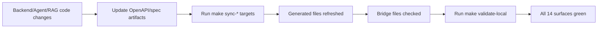

# Codex CLI Setup Guide for ZakOps
## Infrastructure Awareness V5PP — Complete Reference (Codex Edition)

**Version:** V5PP-Codex-V2
**Generated:** 2026-02-12
**Environment:** ZakOps Multi-Repository Development Stack (WSL + Codex CLI)

---

# Executive Overview

## What This Guide Covers

This document explains how Codex CLI is configured and operated in the ZakOps environment. It covers:

1. **Brain Architecture** — How Codex learns the system model
2. **Contract Surfaces** — The 14 typed boundaries and their validators
3. **Operational Workflows** — Daily execution and verification routines
4. **Safety Mechanisms** — Sandbox rules, wrapper lifecycle, and force controls
5. **Troubleshooting** — Common Codex runtime and MCP failures with fixes

## The Core Problem Solved

ZakOps is a cross-service stack with strict contracts:

- **Dashboard** (Next.js) consuming Backend and Agent APIs
- **Backend API** (FastAPI) managing deal lifecycle and state transitions
- **Agent API** (LangGraph + vLLM) providing AI deal operations
- **RAG service** managing retrieval and vector-backed responses

Without Codex-specific setup, the agent would:

- break API and type contracts across services,
- edit generated files that codegen will overwrite,
- miss required validation gates,
- hit unstable MCP startup/connectivity behavior,
- drift from ZakOps operating constraints.

**V5PP Codex setup solves this** by defining a strict operating model: AGENTS + config + memory + wrapper lifecycle + contract-aware validation.

---

# Part 1: Repository & Environment Orientation

## Project Roots

| Repository | Path | Purpose |
|-----------|------|---------|
| **Monorepo** | `/home/zaks/zakops-agent-api` | Agent API, Dashboard, contracts, infra tooling |
| **Backend** | `/home/zaks/zakops-backend` | FastAPI backend, MCP server, migrations |
| **RAG/LLM** | `/home/zaks/Zaks-llm` | RAG service, vLLM, vector database |
| **Bookkeeping** | `/home/zaks/bookkeeping` | Change log, docs, QA evidence, mission outputs |

## Service Map

| Service | Port | Technology | Health Check |
|---------|------|------------|--------------|
| Dashboard | 3003 | Next.js | `GET /` |
| Backend API | 8091 | FastAPI | `GET /health` |
| Agent API | 8095 | FastAPI + LangGraph | `GET /health` |
| RAG API | 8052 | FastAPI | `GET /health` |
| MCP Server | 9100 | custom process | native process check |
| PostgreSQL | 5432 | PostgreSQL | `pg_isready` |
| vLLM | 8000 | vLLM | `GET /health` |
| OpenWebUI | 3000 | Web app | UI reachability |

> **Critical:** Port **8090** is decommissioned. Never reference or reuse it.

## Database Mapping

| Database | Schema | User | Service | Migration Path |
|----------|--------|------|---------|----------------|
| `zakops` | zakops | zakops | Backend API | `zakops-backend/db/migrations/` |
| `zakops_agent` | public | agent | Agent API | `zakops-agent-api/apps/agent-api/migrations/` |
| `crawlrag` | public | env | RAG API | `Zaks-llm/db/migrations/` |

## Key Directories

```text
/home/zaks/zakops-agent-api/
├── apps/
│   ├── dashboard/
│   │   ├── src/lib/                 # generated types (*.generated.ts)
│   │   ├── src/types/               # bridge files
│   │   ├── src/components/
│   │   └── src/hooks/
│   └── agent-api/
│       ├── app/schemas/             # generated backend_models.py
│       ├── app/services/
│       └── app/core/
├── packages/contracts/
│   ├── openapi/
│   ├── mcp/
│   └── sse/
├── tools/infra/
└── .claude/
    ├── commands/
    └── rules/

/home/zaks/.codex/
├── AGENTS.md                         # codex global constitution
├── config.toml                       # runtime config + MCP + profiles
├── rules/default.rules               # sandbox allow prefixes
└── skills/                           # user-level codex skills
```

---

# Part 2: Codex Brain Architecture

## How Codex Learns About Your System

Codex session context is assembled from:

1. **Codex runtime config**: `/home/zaks/.codex/config.toml`
2. **Codex global instructions**: `/home/zaks/.codex/AGENTS.md`
3. **Persistent memory file**: `/home/zaks/.claude/projects/-home-zaks/memory/MEMORY.md`
4. **Project instruction surfaces**:
   - `/home/zaks/zakops-agent-api/.agents/AGENTS.md`
   - `.claude/rules/*.md`
   - `.claude/commands/*.md`

## AGENTS.md — The Constitution

ZakOps Codex policy is centralized in `/home/zaks/.codex/AGENTS.md`:

- session lifecycle contract,
- service map and key paths,
- critical rules,
- WSL hazards and privilege model,
- contract surfaces and constraint registry,
- generated-file protections,
- lab loop detection rules,
- capability-gap register.

### Example AGENTS.md Structure

```markdown
# ZakOps — Codex CLI Operating Instructions

## Session Lifecycle
[read MEMORY at start, write CHANGES at end]

## Service Map
[ports, stacks, ownership]

## Critical Rules
[port bans, evidence requirements, secrets]

## Contract Surfaces
[table of surfaces + sync/validation commands]

## Capability Gaps
[explicit non-replicable Claude features]
```

## Skills

Codex skill inventory is split into:

| Skill Domain | Count | Path |
|-------------|------:|------|
| User skills | 19 | `/home/zaks/.codex/skills/*/SKILL.md` |
| Project skills | 7 | `/home/zaks/zakops-agent-api/.agents/skills/*/SKILL.md` |

Representative skill types:

- workflow skills (`fix-bug`, `implement-feature`, `investigate`),
- governance skills (`verification-standards`, `security-and-data`),
- operational skills (`run-gates`, `health-check`, `deploy-*`).

## Commands

Project command docs live in `/home/zaks/zakops-agent-api/.claude/commands/`.

Current set includes 16 command definitions, including:

- `validate.md`, `sync-all.md`, `contract-checker.md`,
- `infra-check.md`, `after-change.md`,
- `validate-mission.md`, `tripass.md`, and others.

## Lifecycle Wrappers (Codex Equivalent of Hooked Safety)

Codex lacks Claude’s native pre/post tool hook family. ZakOps compensates with wrapper lifecycle scripts:

| Script | Role |
|-------|------|
| `codex-boot.sh` | pre-session diagnostics and verdict |
| `codex-stop.sh` | post-session validation (`make validate-local`) |
| `codex-notify.sh` | notify-event logging |
| `codex-wrapper.sh` | orchestrator (`codex-safe` alias target) |

### `codex-safe` Contract

1. Run boot checks.
2. Block on HALT unless force override is explicitly reasoned.
3. Run Codex command.
4. Run post-session validation.
5. Log events (`SESSION_START`, `STOP`, `SESSION_END`, `FORCE_OVERRIDE`).

## MCP Servers

Configured in `/home/zaks/.codex/config.toml`:

| MCP | Command | Args | Startup Timeout | Tool Timeout |
|-----|---------|------|----------------:|-------------:|
| github | `/home/zaks/.npm-global/bin/mcp-server-github` | `[]` | 45s | 120s |
| playwright | `/home/zaks/.npm-global/bin/playwright-mcp` | `--headless --no-sandbox --isolated` | 30s | 120s |

**Important:** `--isolated` avoids persistent browser-profile lock contention across sessions.

## Profiles

| Profile | Sandbox | Purpose |
|--------|---------|---------|
| `labloop-qa` | read-only | strict QA mode |
| `labloop-qa-debug` | workspace-write | QA debugging |
| `builder` | workspace-write | implementation mode |
| `review` | read-only | deep review |
| `forensic` | read-only | forensic analysis |

## Autonomy Ladder

### Level 1 — Review/Forensic

- Read-only execution.
- High-reasoning analysis.
- No file mutations.

### Level 2 — Builder

- Workspace writes enabled.
- Full verification expected before completion claim.

### Level 3 — Force Override (Controlled)

- `CODEX_FORCE=1` allowed only with `CODEX_FORCE_REASON`.
- Every override logged with actor/cwd/reason/args.
- Use only for diagnostic deadlocks, not routine workflows.

## Rollback Procedures

### Full Codex Config Rollback

```bash
cp /home/zaks/.codex/config.toml /home/zaks/.codex/config.toml.bak.$(date +%Y%m%d%H%M%S)
# restore prior known-good copy if required
```

### MCP-Only Rollback

```bash
# remove or reset MCP servers
/home/zaks/.npm-global/bin/codex mcp remove github
/home/zaks/.npm-global/bin/codex mcp remove playwright
# then re-add known-good commands
```

### Wrapper Disable (Temporary)

```bash
# bypass codex-safe alias for emergency direct run
/home/zaks/.npm-global/bin/codex --version
```

### Recovery After Root-Owned Drift

```bash
sudo chown -R zaks:zaks /home/zaks/.codex /home/zaks/bookkeeping
```

## Permissions

### Permission Types

1. Codex sandbox mode (`read-only`, `workspace-write`, `danger-full-access`)
2. Prefix-rule allow policy (`default.rules`)
3. Trusted project declarations (`config.toml`)
4. OS-level privileges (`sudo -n` where required)

### ZakOps Permission Configuration

- Default sandbox: `read-only`
- Default approvals: `never`
- Prefix rules: 43 structured entries
- Trusted project roots: 4
- Persistent privilege policy: `zaks` may run root-equivalent operations with `sudo`, but only for blocked tasks.

## Safety Rules

### Redaction Policy

Never print secrets from:

- `.env*` files,
- auth tokens and API keys,
- credential stores and private config files.

### Guardrails

- never edit generated files directly,
- never bypass validation gates without explicit non-applicability rationale,
- never claim success without evidence,
- never use deprecated port 8090.

### Destructive Command Guardrails

- No destructive operations unless explicitly requested.
- No blind `rm -rf`, hard reset, or branch-destructive action.
- Use least-privilege and restore ownership where elevation occurs.

---

# Part 3: The 14 Contract Surfaces

## What Is a Contract Surface?

A contract surface is a typed or schema boundary between services/components where drift creates runtime breakage.

## Hybrid Guardrail Pattern

ZakOps uses a hybrid approach:

1. **Generation** (`make sync-*`) for machine-derived artifacts.
2. **Bridge files** for stable imports and manual refinements.
3. **Validation gates** to catch drift and forbidden patterns.

## The 14 Surfaces

### Surface 1: Backend -> Dashboard (TypeScript)

- Source: `packages/contracts/openapi/zakops-api.json`
- Generated: `apps/dashboard/src/lib/api-types.generated.ts`
- Sync: `make sync-types`

### Surface 2: Backend -> Agent SDK (Python)

- Source: same OpenAPI backend spec
- Generated: `apps/agent-api/app/schemas/backend_models.py`
- Sync: `make sync-backend-models`

### Surface 3: Agent API OpenAPI Spec

- Source: agent API routes/models
- Output: `packages/contracts/openapi/agent-api.json`
- Sync: `make update-agent-spec`

### Surface 4: Agent -> Dashboard (TypeScript)

- Source: `agent-api.json`
- Generated: `apps/dashboard/src/lib/agent-api-types.generated.ts`
- Sync: `make sync-agent-types`

### Surface 5: RAG -> Backend SDK (Python)

- Source: RAG API contract
- Generated: `zakops-backend/src/schemas/rag_models.py`
- Sync: `make sync-rag-models`

### Surface 6: MCP Tool Schemas

- Source: tool schema definitions
- Output: exported MCP schema artifacts

### Surface 7: SSE Event Schema

- Source: event stream contract
- Output: SSE schema references

### Surface 8: Agent Config

- Validator: `make validate-agent-config`

### Surface 9: Design System -> Dashboard

- Validator: `make validate-surface9`

### Surface 10: Dependency Health

- Validator: `make validate-surface10`

### Surface 11: Env Registry

- Validator: `make validate-surface11`

### Surface 12: Error Taxonomy

- Validator: `make validate-surface12`

### Surface 13: Test Coverage

- Validator: `make validate-surface13`

### Surface 14: Performance Budget

- Validator: `make validate-surface14`

## Codegen Flow Diagram



---

# Part 4: Daily Standard Operating Procedures

## Morning Health Check

```bash
cd /home/zaks/bookkeeping && make health
cd /home/zaks/bookkeeping && make snapshot
/home/zaks/.npm-global/bin/codex mcp list --json
bash -ic 'codex-safe --version'
```

## Pre-Task Protocol

1. Confirm current working repo and affected surfaces.
2. Read relevant AGENTS/rules/skills before edits.
3. If API boundaries are touched, run corresponding `sync-*` plan first.
4. Confirm no outstanding HALT condition from boot diagnostics.

## Post-Task Protocol

1. Run required `make sync-*` targets.
2. Run `make validate-local`.
3. Verify MCP-dependent flows if change touched automation/browser/integration paths.
4. Record changes in `/home/zaks/bookkeeping/CHANGES.md`.

## Validation Tier Split

| Tier | Command | Purpose |
|------|---------|---------|
| Fast | `make validate-fast` | quick local confidence |
| Local | `make validate-local` | primary offline gate |
| Full | `make validate-full` | broad validation (when required) |

## Weekly Maintenance

```bash
# Infrastructure snapshot
cd /home/zaks/bookkeeping && make snapshot

# Re-check MCP health and startup stability
/home/zaks/.npm-global/bin/codex mcp get github --json
/home/zaks/.npm-global/bin/codex mcp get playwright --json

# Run baseline contract verification
cd /home/zaks/zakops-agent-api && make validate-local

# Review change ledger trend
sudo -n tail -n 80 /home/zaks/bookkeeping/CHANGES.md
```

---

# Part 5: Troubleshooting Playbook

## Problem: Config Parse Failure (unknown variant in config.toml)

Symptoms:

- `failed to load configuration`
- `unknown variant ... in history.persistence`

Fix:

```bash
# Valid values are save-all or none
sed -n '1,140p' /home/zaks/.codex/config.toml
```

Ensure:

```toml
[history]
persistence = "save-all"
```

## Problem: GitHub MCP Startup Timeout

Symptoms:

- `mcp: github failed: MCP client ... timed out after 10 seconds`

Fix:

1. Use local binary (not transient npx path):

```toml
[mcp_servers.github]
command = "/home/zaks/.npm-global/bin/mcp-server-github"
args = []
startup_timeout_sec = 45
tool_timeout_sec = 120
```

2. Re-test:

```bash
/home/zaks/.npm-global/bin/codex mcp get github --json
```

## Problem: Playwright "Browser is already in use"

Symptoms:

- profile lock errors under `.../mcp-chrome`
- transport closures in mixed multi-session use

Fix:

```toml
[mcp_servers.playwright]
args = ["--headless", "--no-sandbox", "--isolated"]
startup_timeout_sec = 30
tool_timeout_sec = 120
```

Retest command:

```bash
/home/zaks/.npm-global/bin/codex exec --cd /home/zaks/bookkeeping --skip-git-repo-check -o /tmp/codex_pw_last.txt "Use Playwright MCP to open https://example.com and return the page title only."
cat /tmp/codex_pw_last.txt
```

## Problem: `codex-safe` HALT

Symptoms:

- boot verdict `HALT -- FIX FIRST`

Fix sequence:

1. Inspect check failures in output.
2. Repair missing generated artifacts or registry drift.
3. Re-run `codex-safe --version`.

## Problem: CHANGES.md Permission Denied

Symptoms:

- file is root-owned and mode-restricted

Fix:

```bash
# non-interactive root append/read
sudo -n tee -a /home/zaks/bookkeeping/CHANGES.md > /dev/null <<'__CHANGE_LOG_ENTRY__'
...entry...
__CHANGE_LOG_ENTRY__
```

Then normalize ownership if policy requires it:

```bash
sudo chown zaks:zaks /home/zaks/bookkeeping/CHANGES.md
```

## Problem: `make validate-local` fails with .next cache EACCES

Symptoms:

- dashboard lint/ts steps fail on `.next/cache` write

Fix:

- clear/replace root-owned cache directory with user-owned path,
- rerun `make validate-local`.

## Problem: `invalid SKILL.md` Warnings

Symptoms:

- skipped loading skill warnings on startup

Fix:

Ensure each skill starts with valid frontmatter:

```markdown
---
name: <skill-name>
description: <short description>
---
```

## Problem: Not inside trusted directory

Symptoms:

- codex exec refuses to run in non-trusted path

Fix:

- run with `--cd` into trusted project root and use `--skip-git-repo-check` when appropriate.

---

# Part 6: Anti-Patterns to Avoid

## Never Edit Generated Files Directly

Bad:

- editing `*.generated.ts`
- editing `*_models.py` from codegen

Correct:

- change source schema/spec,
- run proper `make sync-*` command,
- verify and commit generated diff.

## Never Import Generated Files Directly

Use bridge files (`src/types/*`) for app imports.

## Never Use Untyped Backend Access in Agent Tools

Always use typed client patterns (`BackendClient`) and validated response models.

## Never Skip Validation After Changes

Bad workflow:

1. edit code
2. commit immediately

Correct workflow:

1. edit code
2. run required sync commands
3. run `make validate-local`
4. record change log
5. commit

## Never Bypass `codex-safe` as Default Habit

Direct `codex` invocation is acceptable for targeted diagnostics.
Default operational path should remain `codex-safe` to keep lifecycle checks active.

## Never Use `CODEX_FORCE=1` Without Reason

This is hard-blocked by policy; always supply `CODEX_FORCE_REASON` for auditable force runs.

---

# Appendix A: Key Commands Reference

## Makefile Targets

| Target | Purpose |
|--------|---------|
| `make sync-types` | backend -> dashboard types |
| `make sync-backend-models` | backend -> agent python models |
| `make update-agent-spec` | regenerate agent openapi |
| `make sync-agent-types` | agent -> dashboard types |
| `make sync-rag-models` | rag -> backend models |
| `make validate-local` | primary offline gate |
| `make infra-check` | infra health checks |
| `make validate-surface9`..`14` | surface-specific validators |

## Codex Commands

```bash
# Core
/home/zaks/.npm-global/bin/codex --version
/home/zaks/.npm-global/bin/codex mcp list --json
/home/zaks/.npm-global/bin/codex mcp get github --json
/home/zaks/.npm-global/bin/codex mcp get playwright --json

# Preferred launcher
bash -ic 'codex-safe --version'

# Force override (audited)
CODEX_FORCE=1 CODEX_FORCE_REASON="<reason>" codex-safe --version
```

## Bookkeeping Commands

```bash
# Snapshot + health
cd /home/zaks/bookkeeping && make snapshot
cd /home/zaks/bookkeeping && make health

# Change log append when root-owned
sudo -n tee -a /home/zaks/bookkeeping/CHANGES.md > /dev/null
```

---

# Appendix B: Key Files Reference

## Configuration Files

- `/home/zaks/.codex/config.toml`
- `/home/zaks/.codex/AGENTS.md`
- `/home/zaks/.codex/rules/default.rules`
- `/home/zaks/.claude/projects/-home-zaks/memory/MEMORY.md`
- `/home/zaks/zakops-agent-api/.agents/AGENTS.md`

## Runtime Scripts

- `/home/zaks/scripts/codex-wrapper.sh`
- `/home/zaks/scripts/codex-boot.sh`
- `/home/zaks/scripts/codex-stop.sh`
- `/home/zaks/scripts/codex-notify.sh`

## MCP and Contract Artifacts

- `/home/zaks/.npm-global/bin/mcp-server-github`
- `/home/zaks/.npm-global/bin/playwright-mcp`
- `/home/zaks/zakops-agent-api/packages/contracts/openapi/zakops-api.json`
- `/home/zaks/zakops-agent-api/packages/contracts/openapi/agent-api.json`

## Generated Files (DO NOT EDIT)

- `/home/zaks/zakops-agent-api/apps/dashboard/src/lib/api-types.generated.ts`
- `/home/zaks/zakops-agent-api/apps/dashboard/src/lib/agent-api-types.generated.ts`
- `/home/zaks/zakops-agent-api/apps/agent-api/app/schemas/backend_models.py`
- `/home/zaks/zakops-backend/src/schemas/rag_models.py`

## Documentation

- `/home/zaks/bookkeeping/docs/MISSION-PROMPT-STANDARD.md`
- `/home/zaks/bookkeeping/docs/MISSION-PROMPT-QUICKSTART.md`
- `/home/zaks/bookkeeping/docs/QA-CODEX-ALIGN-VERIFY-001.md`
- `/home/zaks/bookkeeping/docs/ZakOps-V7PP-Codex-CLI-Infrastructure-Reference-Version-2.md`

---

# Appendix C: Glossary

| Term | Meaning |
|------|---------|
| AGENTS.md | Codex instruction constitution loaded per session |
| Contract Surface | Typed/schema boundary between components |
| Bridge File | Stable import layer shielding generated artifacts |
| Boot Verdict | `ALL CLEAR` / `PROCEED WITH CAUTION` / `HALT` from `codex-boot.sh` |
| `CODEX_FORCE` | Explicit override flag requiring reason metadata |
| MCP configured status | Server registration and transport correctness |
| MCP connectivity status | Successful real tool invocation |
| `validate-local` | Primary offline quality and contract gate |

---

# Document Information

| Field | Value |
|-------|-------|
| Document Name | CodexCLI_Setup_ZakOps_V5PP_Guide_V2.md |
| Class | Setup + Operations Guide |
| Primary Audience | Engineers using Codex CLI in ZakOps |
| Maintainer | ZakOps Platform Operations |
| Last Updated | 2026-02-12 |
| Update Trigger | Any change to codex config, wrapper scripts, MCP config, contract surfaces, or lifecycle policy |

---

*End of Document - CodexCLI_Setup_ZakOps_V5PP_Guide_V2.md*
