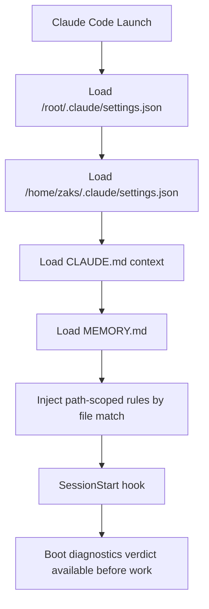
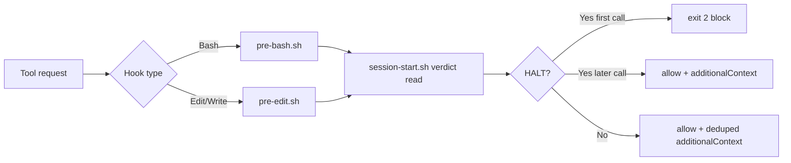
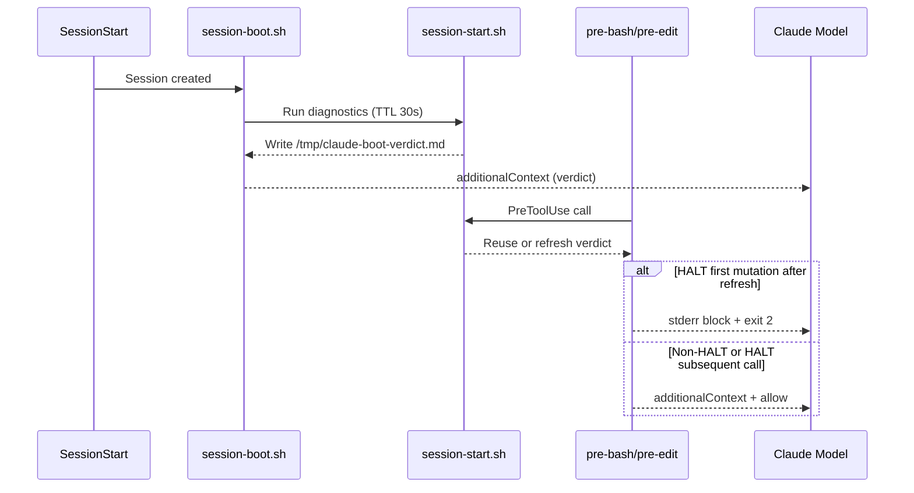

# ZakOps Agentic AI OS

## Claude Code Infrastructure Reference

### Version 2 (V7PP Consolidated + Live State Overlay)

| Field | Value |
|---|---|
| Document Class | Authoritative Infrastructure Reference |
| Build | Version 2 (Merged from Document 1 + Document 2) |
| Date | February 10, 2026 |
| Base Source | ZakOps-V6PP-Claude-Code-Infrastructure-Reference.docx (Document 2) |
| Patch Source | V6PP-to-V7PP-Patch-SELF-HEAL-001.md (Document 1) |
| Scope | Claude Code runtime infrastructure, safety layer, self-healing diagnostics, memory, contract surfaces |
| Preservation Guarantee | All words from both input sources are retained in Appendix X (verbatim retention blocks) |

---

## 1. Executive Summary

This Version 2 document consolidates the V6PP infrastructure baseline with the V7PP SELF-HEAL-001 patch into one operational reference.

It preserves all original source content and upgrades the top-level narrative to reflect current configuration behavior and the boot-diagnostics self-healing architecture.

### 1.1 Consolidated Snapshot (V7PP + Live Verification)

| Component | V6PP Baseline | V7PP Patch Target | Live State (Feb 10, 2026) |
|---|---:|---:|---:|
| Hook Scripts | 5 | 7 | 7 |
| Slash Commands | 13 | 15 | 15 |
| Path-Scoped Rules | 5 | 5 | 5 |
| User Deny Rules | 12 | 12 | 12 |
| User Allow Patterns | 4 | 4 | 4 |
| Root Allow Entries | ~147 (doc) | ~132 (patch narrative) | 140 |
| Contract Registry Entries | n/a (in V6PP) | 10 | 10 |
| Boot Diagnostics Checks | n/a (in V6PP) | 6 + 1 bonus | 6 + 1 bonus |
| AUTOSYNC Sentinels | 6 | 7 | 7 |
| Completed Missions | 10 | 11 | 12 (includes post-patch SURFACE-REMEDIATION-001 in live memory) |
| Health Log Entries | n/a | active | 104 lines, 100 retained data entries policy |

### 1.2 High-Impact Architectural Change

The V7PP patch introduces a closed-loop **boot diagnostics + HALT enforcement + context injection** system that runs:

1. At session start (`SessionStart` hook via `session-boot.sh`)
2. Before mutation tools (`PreToolUse` for `Bash`, `Edit`, `Write`)
3. With deduplicated display and periodic revalidation (30s TTL)
4. With trend logging and recurrence detection (`health-log.md`)

---

## 2. Configuration Architecture

### 2.1 Three-Tier Settings Model

| Tier | Path | Purpose |
|---|---|---|
| Root-Level | `/root/.claude/settings.json` | Runtime-accumulated permissions, root MCP servers, top-level `dangerouslySkipPermissions` |
| User-Level | `/home/zaks/.claude/settings.json` | Designed deny/allow policy, hook registration, user MCP servers |
| Project-Level | `/home/zaks/zakops-agent-api/.claude/` | Rules, command workflows, project constitution (`CLAUDE.md`) |

### 2.2 Loading and Runtime Flow



### 2.3 CLAUDE.md Split

| File | Path | Purpose |
|---|---|---|
| Root CLAUDE.md | `/home/zaks/CLAUDE.md` | Operational quick reference |
| Monorepo CLAUDE.md | `/home/zaks/zakops-agent-api/CLAUDE.md` | Constitution and contract-surface authority |

Live measurement on February 10, 2026:

- Root CLAUDE.md: 64 lines
- Monorepo CLAUDE.md: 144 lines

---

## 3. Permissions and Enforcement Model

### 3.1 Designed Policy (User-Level)

- 12 deny rules protect generated artifacts and environment files.
- 4 wildcard allow patterns enable intended `make sync-*`, `validate-*`, `infra-*`, and `update-*` workflows.

### 3.2 Runtime Reality: `dangerouslySkipPermissions`

At root level, `dangerouslySkipPermissions: true` is present at top level.

Consequence:

1. Runtime permission checks bypass allow/deny arrays.
2. User/root allow arrays are effectively non-enforcement metadata.
3. Actual hard enforcement is implemented by hooks (`exit 2` blocks).

### 3.3 Effective Safety Layer (What Actually Stops Unsafe Actions)



---

## 4. Hook System (V7PP)

### 4.1 Registered Hooks

| Hook Script | Trigger | Role |
|---|---|---|
| `pre-edit.sh` | `PreToolUse (Edit|Write)` | Boot verdict injection, HALT gating, protected-file and branch block rules |
| `pre-bash.sh` | `PreToolUse (Bash)` | Boot verdict injection, HALT gating, destructive command block rules |
| `session-boot.sh` | `SessionStart` | Boot verdict context injection at session creation |
| `post-edit.sh` | `PostToolUse (Edit|Write, async)` | Best-effort file formatting and JSON validity checks |
| `stop.sh` | `Stop` | End-of-session validation gates + memory sync invocation |
| `memory-sync.sh` | `Stop via stop.sh` | AUTOSYNC updates, allow-prune integration, health-log trimming |
| `session-start.sh` | called by hooks | Boot diagnostics engine (6 checks + 1 bonus) |

### 4.2 Output-Channel Contract (Critical)

| Exit Code | stdout | stderr | Tool Execution |
|---:|---|---|---|
| 0 | Parsed JSON supports `hookSpecificOutput.additionalContext` | Not model-visible by default | Allowed |
| 2 | Ignored for context semantics | Blocking message to model | Blocked |
| 1/3+ | Non-blocking error path | Primarily verbose/diagnostic | Usually allowed |

Operational rule:

- Inform model without blocking: **JSON on stdout with `additionalContext`, exit 0**
- Block execution: **message to stderr, exit 2**

---

## 5. Boot Diagnostics Subsystem (SELF-HEAL-001)

### 5.1 Checks

| Check | Name | Purpose | Failure Class |
|---|---|---|---|
| 1 | Memory Integrity | canonical memory file + symlink sanity | FAIL |
| 2 | Surface Count Consistency | surface count concordance across memory and CLAUDE.md | FAIL |
| 3 | Sentinel Freshness | AUTOSYNC data freshness against filesystem | WARN |
| 4 | Generated Files Exist | required generated artifacts are present/non-empty | FAIL |
| 5 | Codegen Freshness | spec timestamp does not outrun generated files | WARN |
| 6 | Constraint Registry | each registry entry maps to rule file + expected string | FAIL |
| B1 | Root Allow Array Size | bloat signal if >100 allows | WARN (skipped when `dangerouslySkipPermissions=true`) |

### 5.2 Verdict States

| Verdict | Condition | Effect |
|---|---|---|
| ALL CLEAR | no warnings, no failures | allow with informational context |
| PROCEED WITH CAUTION | warnings only | allow with caution context |
| HALT — FIX FIRST | one or more failures | first mutation attempt blocked, later attempts allowed for remediation |

### 5.3 Lifecycle Diagram



### 5.4 Temporary State Files

| Path | Purpose | Lifecycle |
|---|---|---|
| `/tmp/claude-session-boot` | diagnostics TTL sentinel | 30 seconds |
| `/tmp/claude-boot-verdict.md` | rendered verdict text | overwritten on refresh |
| `/tmp/claude-boot-verdict-shown-hash` | dedup marker for verdict display | reset on refresh |
| `/tmp/claude-halt-enforced` | “first HALT block already applied” marker | reset on refresh |
| `/tmp/claude-health-logged` | health-log flood guard | 300 seconds |
| `/tmp/claude-boot-evidence` | execution trace evidence | overwritten each run |

---

## 6. Constraint Registry and Allow Pruning

### 6.1 Constraint Registry

- Location: `/home/zaks/zakops-agent-api/.claude/CONSTRAINT_REGISTRY.md`
- Format: `CONSTRAINT_NAME | RULE_FILE | SEARCH_STRING`
- Checked by boot CHECK 6.
- Current entries: 10.

### 6.2 Allow Pruner

| Component | Path | Function |
|---|---|---|
| Script | `/home/zaks/zakops-agent-api/tools/infra/prune-allows.py` | removes redundant/duplicate root allow entries |
| Command | `/home/zaks/zakops-agent-api/.claude/commands/prune-allows.md` | manual invocation guide |
| Auto-run | `memory-sync.sh` | executes `prune-allows.py --quiet` at stop |

Current observed state:

- Root allow array length: 140
- Root permissions bypass flag: `dangerouslySkipPermissions=true`
- Practical implication: allow pruning is hygiene/maintenance, not runtime-enforcement critical path.

---

## 7. Commands, Agents, and Surfaces

### 7.1 Slash Commands

Total command files in project command directory: 15.

New commands introduced in patch:

1. `before-task.md`
2. `prune-allows.md`

### 7.2 Agent Topology

Primary session delegates to specialized agents:

1. `contract-guardian.md` (read-only contract auditor)
2. `arch-reviewer.md` (read-only architecture reviewer)
3. `test-engineer.md` (test runner/planner)

External CLI integrations in TriPass context:

- Gemini CLI
- Codex CLI

### 7.3 Contract Surfaces

The 9-surface Hybrid Guardrail model from V6PP remains authoritative, with V7PP adding stronger startup verification and enforcement traceability.

---

## 8. Memory, Logging, and Health Trends

### 8.1 Memory Sync Enhancements

`memory-sync.sh` now includes:

1. Root allow array prune invocation
2. Health-log retention trim (last 100 entries with header retention)
3. AUTOSYNC `health_log_entries` sentinel updates

### 8.2 Health Log

- Path: `/home/zaks/bookkeeping/health-log.md`
- One-line row append per diagnostics run (subject to dedup throttle)
- Recurrence signal appended to verdict when non-clear states repeat across recent sessions

### 8.3 AUTOSYNC Sentinel Set (7)

| Sentinel | Source |
|---|---|
| `claude_md_lines` | monorepo CLAUDE.md line count |
| `deny_rules` | user settings deny count |
| `hook_count` | hook script count |
| `rule_count` | rules directory count |
| `redocly_ignores` | lint ignore count |
| `v6pp_guide_lines` | setup guide line count |
| `health_log_entries` | health log entry count |

---

## 9. Service and Environment Reference

### 9.1 Service Map (Inherited V6PP Baseline)

| Service | Port | Status |
|---|---:|---|
| Dashboard (Next.js) | 3003 | Active |
| Backend API | 8091 | Active |
| Agent API | 8095 | Active |
| RAG Service | 8052 | Active |
| vLLM | 9100 | Active |
| OpenWebUI | 3000 | Active |
| Monitoring | 8000 | Active |
| PostgreSQL | 5432 | Active, canonical |
| Legacy DB port | 5435 | Decommissioned |
| Legacy backend port | 8090 | Decommissioned |

### 9.2 WSL Hazards

1. CRLF endings on new writes
2. Root ownership on created files
3. Dual tool-path confusion
4. `grep -c` exit-code pitfalls

---

## 10. Key Paths (V7PP Reference)

| Category | Path |
|---|---|
| User settings | `/home/zaks/.claude/settings.json` |
| Root settings | `/root/.claude/settings.json` |
| Hooks directory | `/home/zaks/.claude/hooks/` |
| Boot engine | `/home/zaks/.claude/hooks/session-start.sh` |
| SessionStart bridge hook | `/home/zaks/.claude/hooks/session-boot.sh` |
| Memory sync hook | `/home/zaks/.claude/hooks/memory-sync.sh` |
| Constraint registry | `/home/zaks/zakops-agent-api/.claude/CONSTRAINT_REGISTRY.md` |
| Commands directory | `/home/zaks/zakops-agent-api/.claude/commands/` |
| Rules directory | `/home/zaks/zakops-agent-api/.claude/rules/` |
| Allow pruner script | `/home/zaks/zakops-agent-api/tools/infra/prune-allows.py` |
| Health log | `/home/zaks/bookkeeping/health-log.md` |
| Canonical memory | `/root/.claude/projects/-home-zaks/memory/MEMORY.md` |
| Symlink memory path | `/root/.claude/projects/-mnt-c-Users-mzsai/memory` |

---

## 11. Mission Ledger (Consolidated View)

- V6PP source records 10 completed missions.
- V7PP patch adds SELF-HEAL-001 as mission 11.
- Live memory now includes an additional post-patch mission (`SURFACE-REMEDIATION-001`), bringing live count to 12.

This document preserves the V6PP and patch mission statements exactly in Appendix X and adds this live-state note for operational accuracy.

---

## 12. Document Governance

### 12.1 Source Preservation Strategy

To satisfy strict no-loss requirements, this Version 2 includes two verbatim source-retention appendices:

1. Document 2 extracted text block (full content)
2. Document 1 patch block (full content)

### 12.2 Why This Structure

- Main body: clean, explainable, end-to-end operational reference.
- Appendices: immutable source retention for compliance and audit traceability.

---

# Appendix X-A — Verbatim Retention of Document 2

**Source:** `/home/zaks/bookkeeping/docs/ZakOps-V6PP-Claude-Code-Infrastructure-Reference.docx`  
**Extraction method:** `pandoc -t gfm --wrap=none`  
**Retention guarantee:** Full extracted text included below without deletion.

````markdown
**ZakOps Agentic AI OS**

Claude Code Infrastructure Reference

V6PP Configuration — Verified Build

Date: February 9, 2026

Status: Production-Verified (4 Independent Session Diagnostics)

Supersedes: V5PP-DMS (2026-02-07)

Table of Contents

1\. Executive Summary

This document is the authoritative reference for the ZakOps Claude Code infrastructure as verified on February 9, 2026. Every factual claim in this document has been verified against the live filesystem across four independent Claude Code sessions launched from different working directories.

The ZakOps platform is an AI-driven deal management and operations system built on a monorepo architecture with 4 project roots, 9 contract surfaces, a 4-agent topology with 2 external model integrations, and a multi-agent TriPass pipeline. The Claude Code configuration manages permissions, hooks, rules, commands, agents, and persistent memory through a layered settings hierarchy.

|                           |           |                                            |
|---------------------------|-----------|--------------------------------------------|
| **Component**             | **Count** | **Status**                                 |
| Contract Surfaces         | 9         | All verified                               |
| Path-Scoped Rules         | 5         | All active with YAML frontmatter           |
| Slash Commands            | 13        | All present                                |
| Agent Definitions         | 3         | All reference 9 surfaces                   |
| Hook Scripts              | 5         | All executable, correct triggers           |
| Deny Rules                | 12        | User-level, 4 Edit + 4 Edit .env + 4 Write |
| Allow Patterns (Designed) | 4         | User-level make \* wildcards               |
| MCP Servers               | 4         | 2 user-level, 2 root-level                 |
| Completed Missions        | 10        | All recorded in MEMORY.md                  |

2\. Configuration Hierarchy

Claude Code loads configuration from three tiers. Each tier serves a distinct purpose. Settings merge at runtime with more specific tiers taking precedence.

2.1 Three-Tier Settings Architecture

|               |                                      |                                                                                                                                                       |
|---------------|--------------------------------------|-------------------------------------------------------------------------------------------------------------------------------------------------------|
| **Tier**      | **File Path**                        | **Purpose**                                                                                                                                           |
| Root-Level    | /root/.claude/settings.json          | Accumulated runtime approvals, system MCP servers (gmail, crawl4ai-rag). Allow array grows with each session approval (~147 entries, unstable count). |
| User-Level    | /home/zaks/.claude/settings.json     | Designed permissions: 12 deny rules, 4 allow patterns, 5 hooks, 2 MCP servers (github, playwright-disabled).                                          |
| Project-Level | /home/zaks/zakops-agent-api/.claude/ | Rules, commands, CLAUDE.md. No project-level settings.json exists.                                                                                    |

2.2 Configuration Loading Order

When Claude Code launches, it loads configuration in this sequence:

- Root-level settings (/root/.claude/settings.json) — system-wide permissions and MCP servers

- User-level settings (/home/zaks/.claude/settings.json) — designed deny/allow rules, hooks, project MCP servers

- CLAUDE.md files — root operational reference (64 lines) then monorepo constitution (145 lines, ceiling: 150)

- Persistent memory — MEMORY.md loaded from project directory matching current working directory

- Path-scoped rules — injected dynamically when file paths match YAML frontmatter triggers

3\. The CLAUDE.md Split

Two CLAUDE.md files serve different purposes. Both are loaded into every session's context.

|                    |                                       |           |                                                                                                                |
|--------------------|---------------------------------------|-----------|----------------------------------------------------------------------------------------------------------------|
| **File**           | **Path**                              | **Lines** | **Purpose**                                                                                                    |
| Root CLAUDE.md     | /home/zaks/CLAUDE.md                  | 64        | Operational quick-reference: service map, key paths, critical constraints                                      |
| Monorepo CLAUDE.md | /home/zaks/zakops-agent-api/CLAUDE.md | 145       | Full constitution: all 9 contract surfaces, agent topology, safety rules, autonomy ladder. Ceiling: 150 lines. |

The monorepo CLAUDE.md is the primary behavioral document. It defines the Hybrid Guardrail pattern, the 4-agent topology, OWASP LLM guardrails, redaction policy, and the complete contract surface table. The 150-line ceiling prevents context bloat — detailed information goes into path-scoped rules, memory, or topic files.

4\. Permission System

4.1 Deny Rules (12)

All 12 deny rules appear in the user-level settings file. They protect generated files and environment configuration from accidental modification.

|        |                                        |                    |
|--------|----------------------------------------|--------------------|
| **\#** | **Rule**                               | **Category**       |
| 1      | Edit(\*/api-types.generated.ts)        | Generated Types    |
| 2      | Edit(\*/agent-api-types.generated.ts)  | Generated Types    |
| 3      | Edit(\*/backend_models.py)             | Generated Types    |
| 4      | Edit(\*/rag_models.py)                 | Generated Types    |
| 5      | Edit(.env)                             | Environment Config |
| 6      | Edit(.env.\*)                          | Environment Config |
| 7      | Edit(\*/.env)                          | Environment Config |
| 8      | Edit(\*/.env.\*)                       | Environment Config |
| 9      | Write(\*/api-types.generated.ts)       | Generated Types    |
| 10     | Write(\*/agent-api-types.generated.ts) | Generated Types    |
| 11     | Write(\*/backend_models.py)            | Generated Types    |
| 12     | Write(\*/rag_models.py)                | Generated Types    |

4.2 Allow Rules — Two Tiers

**User-level (designed):** 4 intentional make wildcard patterns that enable Claude Code to run sync, validation, infrastructure, and update targets without prompting.

|        |                        |                               |
|--------|------------------------|-------------------------------|
| **\#** | **Pattern**            | **Enables**                   |
| 1      | Bash(make sync-\*)     | Contract sync operations      |
| 2      | Bash(make validate-\*) | Validation and drift checks   |
| 3      | Bash(make infra-\*)    | Infrastructure management     |
| 4      | Bash(make update-\*)   | Memory and dependency updates |

**Root-level (accumulated):** ~147 entries (count is unstable, grows with each session approval). These are one-off runtime approvals that persist. The root-level allow array can be periodically pruned without impact, as the 4 user-level patterns cover all intended automation.

5\. Hook System

Five hook scripts are registered in the user-level settings file at /home/zaks/.claude/settings.json. All hooks are located at /home/zaks/.claude/hooks/.

|                |                    |                                                                                                                                                   |
|----------------|--------------------|---------------------------------------------------------------------------------------------------------------------------------------------------|
| **Hook**       | **Event Trigger**  | **Behavior**                                                                                                                                      |
| pre-edit.sh    | PreToolUse (Edit)  | Blocks edits to generated files matching deny patterns. Prevents accidental codegen overwrites.                                                   |
| pre-bash.sh    | PreToolUse (Bash)  | Blocks destructive commands. Validates bash operations before execution.                                                                          |
| post-edit.sh   | PostToolUse (Edit) | Async post-edit validation checks. Verifies edit results after completion.                                                                        |
| stop.sh        | Stop               | Session-end validation. Verifies TriPass awareness, triggers cleanup if needed.                                                                   |
| memory-sync.sh | Stop               | Dynamic memory sentinel updates. Gathers live facts (line counts, file counts, service ports, guide metrics) and patches MEMORY.md AUTOSYNC tags. |

**memory-sync.sh MEMORY_DIR:** */root/.claude/projects/-home-zaks/memory — This is the canonical memory directory. A symlink from the -mnt-c-Users-mzsai path ensures both project directories resolve to the same physical location.*

6\. MCP Servers

Four MCP servers are configured across two tiers. User-level servers support development workflows. Root-level servers provide communication and RAG capabilities.

|              |            |            |                                                         |
|--------------|------------|------------|---------------------------------------------------------|
| **Server**   | **Tier**   | **Status** | **Purpose**                                             |
| github       | User-level | Enabled    | GitHub API integration for repository operations        |
| playwright   | User-level | Disabled   | Browser automation (disabled, available for future use) |
| gmail        | Root-level | Enabled    | Email access for communication workflows                |
| crawl4ai-rag | Root-level | Enabled    | Web crawling and RAG pipeline for knowledge ingestion   |

7\. Path-Scoped Rules

Five rule files in /home/zaks/zakops-agent-api/.claude/rules/ provide context-sensitive guidance. Each rule has YAML frontmatter declaring file path triggers. When Claude Code works on files matching those paths, the rule content is automatically injected into context.

|                      |                                                             |                                                                                                                                                                                                                                                       |
|----------------------|-------------------------------------------------------------|-------------------------------------------------------------------------------------------------------------------------------------------------------------------------------------------------------------------------------------------------------|
| **Rule File**        | **Trigger Paths**                                           | **Key Constraints**                                                                                                                                                                                                                                   |
| backend-api.md       | zakops-backend/src/api/\*\*                                 | transition_deal_state() is the single choke point for all deal state changes. Direct UPDATEs to current_stage, status, or pipeline_stage are prohibited. Enforced by PostgreSQL trigger. References ADR-001.                                          |
| dashboard-types.md   | apps/dashboard/src/types/\*\*                               | Type handling rules for dashboard. Bridge file imports only, never direct generated file imports.                                                                                                                                                     |
| agent-tools.md       | apps/agent-api/app/core/langgraph/tools/\*\*                | Agent tool development constraints. Tool schema consistency with tool-schemas.json.                                                                                                                                                                   |
| design-system.md     | apps/dashboard/src/components/\*\* + app/\*\* + styles/\*\* | Surface 9: Promise.allSettled mandatory, Promise.all banned, caret-color: transparent, console.warn for degradation, server-side counts only. Plus frontend design quality standards (typography, color, motion, spatial composition, anti-patterns). |
| contract-surfaces.md | packages/contracts/\*\* + generated files + bridge files    | Hybrid Guardrail pattern enforcement across all 9 surfaces. Codegen flow, sync commands, drift checking.                                                                                                                                              |

**Important:** There is no frontend-design plugin available to Claude Code. The /mnt/skills/public/frontend-design/ path exists only in the claude.ai web interface. All frontend design standards are embedded directly in design-system.md as part of Surface 9.

8\. Slash Commands (13)

All command files are located in /home/zaks/zakops-agent-api/.claude/commands/. Each provides a reusable workflow invoked with the / prefix in Claude Code.

|        |                       |                                                             |
|--------|-----------------------|-------------------------------------------------------------|
| **\#** | **Command File**      | **Purpose**                                                 |
| 1      | after-change.md       | Post-change validation workflow                             |
| 2      | permissions-audit.md  | Audit current permission configuration                      |
| 3      | hooks-check.md        | Verify hook scripts are executable and correctly registered |
| 4      | infra-check.md        | Infrastructure health verification                          |
| 5      | sync-all.md           | Sync all contract surfaces                                  |
| 6      | sync-backend-types.md | Sync backend type definitions                               |
| 7      | sync-agent-types.md   | Sync agent API type definitions                             |
| 8      | validate.md           | Run full validation pipeline                                |
| 9      | check-drift.md        | Check for contract drift across surfaces                    |
| 10     | contract-checker.md   | Comprehensive contract surface verification                 |
| 11     | update-memory.md      | Manual memory sync trigger                                  |
| 12     | scaffold-feature.md   | Scaffold new feature with proper surface integration        |
| 13     | tripass.md            | Invoke TriPass multi-agent pipeline                         |

9\. Agent Topology

Three agent definitions at /home/zaks/.claude/agents/ provide specialized delegation capabilities. The main-builder (the primary Claude Code session) delegates to these agents for focused tasks.

|                      |           |                                        |                                                                                                                                             |
|----------------------|-----------|----------------------------------------|---------------------------------------------------------------------------------------------------------------------------------------------|
| **Agent**            | **Model** | **Disallowed Tools**                   | **Role**                                                                                                                                    |
| contract-guardian.md | Sonnet    | Edit, Write, WebFetch, WebSearch       | Read-only auditor for all 9 contract surfaces. Validates sync flow, generated files, bridge imports. Cannot modify code.                    |
| arch-reviewer.md     | Opus      | Edit, Write, Bash, WebFetch, WebSearch | Architecture review agent. Evaluates design decisions against the 9 contract surfaces and Deal Integrity patterns. Read-only, no execution. |
| test-engineer.md     | Sonnet    | Edit, WebFetch, WebSearch              | Test planning and validation. Can execute tests via Bash but cannot edit source code or fetch external resources.                           |

9.1 External Model Integrations

Two external CLI models supplement the Claude Code agent topology, primarily used through the TriPass multi-agent pipeline:

- **Gemini CLI** — Python wrapper at /home/zaks/scripts/. Used for independent investigation passes in TriPass pipeline.

- **Codex CLI** — Python wrapper at /home/zaks/scripts/. Used for independent investigation passes in TriPass pipeline.

These are invoked as subprocess tools, not as Claude Code agents. They produce markdown reports that Claude Code consolidates.

10\. The 9 Contract Surfaces

The Hybrid Guardrail pattern governs all inter-service type boundaries: OpenAPI spec defines the contract, codegen produces typed files, bridge files provide stable imports, consumers reference bridges only. Each surface has a boundary definition, validation mechanism, and sync protocol.

|        |                           |                                               |                                                       |
|--------|---------------------------|-----------------------------------------------|-------------------------------------------------------|
| **\#** | **Surface**               | **Boundary**                                  | **Key Artifacts**                                     |
| S1     | Backend REST API          | OpenAPI spec ↔ Dashboard types                | api-types.generated.ts, backend bridge files          |
| S2     | Backend Models            | OpenAPI spec ↔ Python models                  | backend_models.py, model bridge files                 |
| S3     | Agent API Types           | OpenAPI spec ↔ Dashboard types                | agent-api-types.generated.ts                          |
| S4     | RAG Models                | OpenAPI spec ↔ Python models                  | rag_models.py                                         |
| S5     | Shared Contracts          | TypeScript contracts package                  | execution-contracts.ts, PIPELINE_STAGES               |
| S6     | SSE Event Schemas         | Event type definitions                        | SSE type contracts                                    |
| S7     | MCP Schemas               | MCP tool definitions                          | MCP type contracts                                    |
| S8     | Agent Configuration       | deal_tools.py ↔ system.md ↔ tool-schemas.json | Tool definitions, agent config, schema validation     |
| S9     | Design System → Dashboard | Component conventions ↔ Dashboard impl        | design-system.md rule, manifest, validate-surface9.sh |

10.1 Surface 9 — Component Design System

Surface 9 is unique among the contract surfaces. While Surfaces 1-8 govern type boundaries between services, Surface 9 governs how the dashboard is built — both architectural conventions and visual design quality standards.

Category A — Project-Specific Conventions

- Promise.allSettled with typed empty fallbacks is mandatory for multi-fetch operations. Promise.all is banned in dashboard data fetching.

- console.warn for expected degradation paths, console.error for unexpected failures only. React error boundaries wrap major page sections.

- caret-color: transparent at @layer base globally, with input/textarea override to auto.

- Server-side deal counts only. No client-side .length calculations for display counts.

- PIPELINE_STAGES from execution-contracts.ts is the single source of truth for stages. No hardcoded stage arrays.

- All /api/\* requests go through the Next.js middleware proxy. Backend errors return JSON 502, never HTML 500.

- Import from bridge files only (@/types/api, @/types/agent-api), never from generated files directly.

Category B — Frontend Design Quality Standards

Embedded in design-system.md to ensure Claude Code produces distinctive, production-grade frontend work:

- Typography: distinctive fonts appropriate for context, paired display + body fonts for hierarchy. Avoid generic defaults (Inter, Roboto, Arial) without design justification.

- Color: cohesive palette via CSS variables, dominant colors with purposeful accents. Avoid purple-gradient-on-white (hallmark of generic AI design).

- Motion: purposeful CSS-only animations, staggered reveals, meaningful hover states. No decoration without purpose.

- Spatial composition: intentional layouts, asymmetry/overlap where it serves design. No default predictable grids.

- Anti-patterns: no cookie-cutter components, no convergent page designs, no overused font families.

11\. Persistent Memory System

11.1 Architecture

The memory system ensures Claude Code sessions start with accurate context about the project state. It consists of five components:

|                        |                                           |                                                                                                                               |
|------------------------|-------------------------------------------|-------------------------------------------------------------------------------------------------------------------------------|
| **Component**          | **Path**                                  | **Purpose**                                                                                                                   |
| MEMORY.md              | /root/.claude/projects/-home-zaks/memory/ | 132 lines. Primary persistent context. WSL hazards, completed missions, architectural patterns, topic file references.        |
| session-log.md         | Same directory as MEMORY.md               | Rolling session history. Entries from each Claude Code session.                                                               |
| memory-sync.sh         | /home/zaks/.claude/hooks/memory-sync.sh   | Stop hook. Gathers live facts and updates AUTOSYNC sentinel tags in MEMORY.md.                                                |
| Topic files            | Same directory as MEMORY.md               | 5 topic files: contract-surfaces.md, hooks-and-permissions.md, validation-pipeline.md, wsl-environment.md, project-history.md |
| /update-memory command | .claude/commands/update-memory.md         | Manual trigger for memory sync outside session end.                                                                           |

11.2 Split-Brain Resolution

Claude Code resolves project directories based on the working directory at launch time. Two project paths existed:

- /root/.claude/projects/-home-zaks/memory/ (for launches from /home/zaks/)

- /root/.claude/projects/-mnt-c-Users-mzsai/memory/ (for launches from /mnt/c/Users/mzsai/)

**Resolution:** The -mnt-c-Users-mzsai/memory directory is now a symlink pointing to -home-zaks/memory. Both launch paths resolve to the same physical directory. memory-sync.sh targets the canonical -home-zaks path. A backup of the pre-symlink state is preserved at -mnt-c-Users-mzsai/memory.bak.20260209/.

11.3 AUTOSYNC Sentinel Tags

memory-sync.sh gathers 6 live facts and injects them into MEMORY.md using sentinel tags. These auto-update at session end:

- CLAUDE.md line counts (both root and monorepo files)

- Hook count and registration status

- Rule file count

- Command count

- Contract surface count

- V6PP guide line count

12\. Completed Missions

Ten missions have been executed and verified. Each is recorded in MEMORY.md with date, ID, and outcome.

|        |                            |            |                                                                                                                                         |
|--------|----------------------------|------------|-----------------------------------------------------------------------------------------------------------------------------------------|
| **\#** | **Mission ID**             | **Date**   | **Outcome**                                                                                                                             |
| 1      | RT-HARDEN-001 V2           | 2026-02-06 | Runtime hardening. 19/19 gates PASS.                                                                                                    |
| 2      | HYBRID-GUARDRAIL-EXEC-001  | 2026-02-06 | Hybrid Guardrail pattern implementation. Complete.                                                                                      |
| 3      | QA-HG-VERIFY-001-V2        | 2026-02-06 | Hybrid Guardrail QA. FULL PASS after remediation.                                                                                       |
| 4      | DEAL-INTEGRITY-UNIFIED-001 | 2026-02-09 | Deal pipeline integrity. 6 layers, 13 resolved issues. Established FSM, Promise.allSettled, middleware proxy, canonical stages, 3 ADRs. |
| 5      | CONFIG-STABILIZE-001       | 2026-02-09 | Forensic audit remediation. 14 findings remediated across 25 gates.                                                                     |
| 6      | TRIPASS-INTEGRATE-002      | 2026-02-09 | Multi-agent pipeline orchestrator. 9 acceptance criteria, all PASS.                                                                     |
| 7      | QA-TP-VERIFY-001           | 2026-02-09 | TriPass QA round 1. 75/75 gates, 0 remediations.                                                                                        |
| 8      | QA-TP-V2-001               | 2026-02-09 | TriPass QA round 2. 67/67 gates, 142 combined points.                                                                                   |
| 9      | V6-GUIDE-REGEN-001         | 2026-02-09 | V6PP guide generation + Surface 9 + TriPass QA hardening. 10 gates.                                                                     |
| 10     | QA-V6GR-VERIFY-001         | 2026-02-09 | V6PP guide QA. 82/82 gates + 2 INFO, 12 remediations applied.                                                                           |

13\. Deal Integrity Architectural Patterns

The Deal Integrity mission (DEAL-INTEGRITY-UNIFIED-001) established permanent architectural constraints that every future session must follow. These are enforced by database triggers, path-scoped rules, and convention.

State Machine

- transition_deal_state() is the single choke point for all deal state changes.

- No direct UPDATE to current_stage, status, or pipeline_stage is permitted outside this function.

- Enforced by PostgreSQL trigger — the database rejects direct mutations.

- Documented in ADR-001 (Lifecycle FSM).

Data Fetching

- Promise.allSettled with typed empty fallbacks is mandatory for all multi-fetch dashboard operations.

- Promise.all is banned in dashboard page-level data fetching.

API Communication

- All /api/\* requests go through the Next.js middleware proxy.

- Backend errors return JSON 502, never HTML 500.

- Middleware proxy handles API key forwarding and correlation IDs.

Data Authority

- PIPELINE_STAGES in execution-contracts.ts is the single source of truth for stage definitions.

- Server-side deal counts only — no client-side .length for display.

- Documented in ADR-003 (Stage Configuration Authority).

CSS and Error Conventions

- caret-color: transparent at @layer base with input/textarea override.

- console.warn for expected degradation, console.error for unexpected failures.

- React error boundaries wrap major page sections.

Architecture Decision Records

- ADR-001: Lifecycle FSM — transition_deal_state() as single choke point

- ADR-002: Canonical Database — PostgreSQL on port 5432 only, 5435 decommissioned

- ADR-003: Stage Configuration Authority — PIPELINE_STAGES single source of truth

14\. TriPass Multi-Agent Pipeline

TriPass is a reusable 3-agent orchestrator that runs Claude Code, Gemini CLI, and Codex CLI independently, then cross-reviews and consolidates findings into a single deduplicated deliverable.

14.1 Pipeline Architecture

- Pass 1: All 3 agents independently investigate, append findings to WORKSPACE.md (append-only, hash-verified).

- Pass 2: Each agent cross-reviews all Pass 1 reports, deduplicates, appends to WORKSPACE.md.

- Pass 3: Claude Code consolidates everything into FINAL_MASTER.md (single deduplicated deliverable).

- Pass 4 (optional): Meta-QA verifies no-drop and deduplication correctness.

14.2 Modes

- Forensic: Root cause analysis and investigation

- Design: UI/UX review (uses design standards from .claude/rules/design-system.md, NOT any external plugin)

- Implement: Code planning and implementation strategy

14.3 File Locations

|                     |                                                      |
|---------------------|------------------------------------------------------|
| **Artifact**        | **Path**                                             |
| Orchestrator script | /home/zaks/zakops-agent-api/tools/tripass/tripass.sh |
| SOP                 | /home/zaks/bookkeeping/docs/TRIPASS_SOP.md           |
| Templates (4)       | /home/zaks/bookkeeping/docs/\_tripass_templates/     |
| Run directories     | /home/zaks/bookkeeping/docs/\_tripass_runs/          |
| Latest run pointer  | TRIPASS_LATEST_RUN.md                                |
| Slash command       | .claude/commands/tripass.md                          |

14.4 Gates (T-1 through T-6)

|          |                 |                                                                                                                                                     |
|----------|-----------------|-----------------------------------------------------------------------------------------------------------------------------------------------------|
| **Gate** | **Name**        | **Checks**                                                                                                                                          |
| T-1      | Append-Only     | WORKSPACE.md and MASTER_LOG.md are append-only, hash-verified. No overwrites.                                                                       |
| T-2      | Completeness    | 3 Pass 1 reports, 3 Pass 2 reviews, FINAL_MASTER.md all exist.                                                                                      |
| T-3      | Structural      | Identity headers, 5 required fields per finding, evidence references. Returns SKIP (not PASS) on generate-only runs with placeholder content.       |
| T-4      | Drift Detection | Scope enforcement. Halts if \>30% findings are out-of-scope.                                                                                        |
| T-5      | No-Drop         | Every unique Pass 1 finding appears in FINAL_MASTER.md or has justified discard.                                                                    |
| T-6      | Memory Sync     | Mission recorded in MEMORY.md, TRIPASS_LATEST_RUN.md updated, CHANGES.md entry. Idempotent — re-running for same run ID does not duplicate entries. |

14.5 QA Enhancements (Post-Mission 2)

- ENH-3: Trap handler for lock file cleanup (/tmp/tripass.lock) — ensures lock is removed on any exit (normal, error, signal, interrupt).

- ENH-1: Gate T-3 returns SKIP on generate-only mode with placeholder FINAL_MASTER.md.

- ENH-2: Gate T-6 is idempotent — checks for existing run ID in CHANGES.md before writing.

- ENH-9: File ownership fix for WSL — all files created under /home/zaks/ are chowned to zaks:zaks at script end.

- ENH-8: MEMORY.md TriPass section includes all 6 gates (T-1 through T-6) for instant session context.

15\. Service Map

All services with their ports, health endpoints, and current status. PostgreSQL runs on port 5432 only. Port 5435 was decommissioned during the Deal Integrity mission. Port 8090 is decommissioned.

|                       |          |                    |                                      |
|-----------------------|----------|--------------------|--------------------------------------|
| **Service**           | **Port** | **Stack**          | **Status**                           |
| Dashboard (Next.js)   | 3003     | TypeScript / React | Active                               |
| Backend API           | 8091     | Python / FastAPI   | Active                               |
| Agent API             | 8095     | Python / LangGraph | Active                               |
| RAG Service           | 8052     | Python             | Active                               |
| vLLM (Granite 3.0 8B) | 9100     | Python / vLLM      | Active                               |
| OpenWebUI             | 3000     | TypeScript         | Active                               |
| Monitoring            | 8000     | Python             | Active                               |
| PostgreSQL            | 5432     | PostgreSQL         | Active — ONLY valid DB port          |
| (decommissioned)      | 5435     | —                  | DEAD — split-brain source, destroyed |
| (decommissioned)      | 8090     | —                  | DEAD                                 |

16\. WSL Environment Hazards

Claude Code runs in WSL (Windows Subsystem for Linux) on RHEL 8.9. Four critical hazards affect every session:

1\. CRLF Line Endings

Every file written via the Write tool gets Windows line endings. Always run sed -i 's/\r\$//' after writing any .sh file. Symptom: bash\r: not found (exit 127).

2\. Root Ownership

Claude Code runs as root. Every file created is root-owned. Run sudo chown zaks:zaks \<file\> after creating files in /home/zaks/. Symptom: EACCES when user runs make targets. The TriPass orchestrator handles this automatically (ENH-9).

3\. Dual Tool Paths

Monorepo tools at /home/zaks/zakops-agent-api/tools/infra/ vs external tools at /home/zaks/tools/infra/. Makefile expects monorepo-relative paths. Never write scripts to the external path when Makefile references them.

4\. grep -c Exit Code

grep -c returns exit 1 when count is 0. Use VAR=\$(grep -c ... 2\>/dev/null) \|\| VAR=0 — not \$(grep -c ... \|\| echo 0) which captures both outputs.

17\. Key File Paths Reference

|                         |                                                               |
|-------------------------|---------------------------------------------------------------|
| **Category**            | **Path**                                                      |
| MEMORY.md (canonical)   | /root/.claude/projects/-home-zaks/memory/MEMORY.md            |
| MEMORY.md (symlink)     | /root/.claude/projects/-mnt-c-Users-mzsai/memory/ → canonical |
| memory-sync.sh          | /home/zaks/.claude/hooks/memory-sync.sh                       |
| V6PP Guide              | /home/zaks/bookkeeping/docs/V6PP-SETUP-GUIDE.md               |
| CLAUDE.md (root)        | /home/zaks/CLAUDE.md                                          |
| CLAUDE.md (monorepo)    | /home/zaks/zakops-agent-api/CLAUDE.md                         |
| Agent definitions       | /home/zaks/.claude/agents/ (3 files)                          |
| Path-scoped rules       | /home/zaks/zakops-agent-api/.claude/rules/ (5 files)          |
| Slash commands          | /home/zaks/zakops-agent-api/.claude/commands/ (13 files)      |
| Hook scripts            | /home/zaks/.claude/hooks/ (5 scripts)                         |
| Settings (user-level)   | /home/zaks/.claude/settings.json                              |
| Settings (root-level)   | /root/.claude/settings.json                                   |
| TriPass orchestrator    | /home/zaks/zakops-agent-api/tools/tripass/tripass.sh          |
| TriPass SOP             | /home/zaks/bookkeeping/docs/TRIPASS_SOP.md                    |
| TriPass templates       | /home/zaks/bookkeeping/docs/\_tripass_templates/ (4 files)    |
| TriPass run directories | /home/zaks/bookkeeping/docs/\_tripass_runs/                   |
| Surface 9 validator     | /home/zaks/zakops-agent-api/tools/infra/validate-surface9.sh  |
| Gemini/Codex wrappers   | /home/zaks/scripts/                                           |
| ADRs                    | /home/zaks/bookkeeping/docs/                                  |
| QA evidence             | /home/zaks/bookkeeping/qa-verifications/                      |

18\. Document Information

|                      |                                                                                                                                                                                   |
|----------------------|-----------------------------------------------------------------------------------------------------------------------------------------------------------------------------------|
| **Field**            | **Value**                                                                                                                                                                         |
| Document Title       | ZakOps Agentic AI OS — Claude Code Infrastructure Reference                                                                                                                       |
| Version              | V6PP (February 9, 2026)                                                                                                                                                           |
| Supersedes           | V5PP-DMS (February 7, 2026)                                                                                                                                                       |
| Verification         | 4 independent session diagnostics, all converging to clean                                                                                                                        |
| Total Gates Passed   | 82 (QA-V6GR-VERIFY-001) + 12 remediations + 3 post-QA drift corrections                                                                                                           |
| Split-Brain Status   | Permanently resolved via symlink                                                                                                                                                  |
| Known Gaps Addressed | transition_deal_state in backend-api.md, allow rule two-tier docs, guide line count auto-sync                                                                                     |
| Next: In Flight      | FORENSIC-AUDIT-SURFACES-002 — ground truth discovery for Surfaces 10–14                                                                                                           |
| Next: Planned        | Implementation mission for Surface 10 (Dependency Health), Surface 11 (Secret Registry), Surface 12 (Error Taxonomy), Surface 13 (Test Coverage), Surface 14 (Performance Budget) |
````

# Appendix X-B — Verbatim Retention of Document 1

**Source:** `/home/zaks/bookkeeping/docs/V6PP-to-V7PP-Patch-SELF-HEAL-001.md`  
**Retention guarantee:** Full source text included below without deletion.

````markdown
# ZakOps Agentic AI OS — Infrastructure Reference Patch

## V6PP → V7PP: SELF-HEAL-001 (Boot Diagnostics & Self-Healing Infrastructure)

**Date:** February 9–10, 2026

**Status:** Production-Verified (6 independent QA sessions, 11 iterations)

**Applies to:** ZakOps-V6PP-Claude-Code-Infrastructure-Reference.docx (February 9, 2026)

**Mission:** SELF-HEAL-001 — Closed-loop self-diagnostic system with automatic boot checks, HALT enforcement, constraint verification, and health logging.

---

## Section-by-Section Patch Instructions

### Section 1: Executive Summary — Count Updates

Update the summary table:

| Component | V6PP Value | V7PP Value | Change |
|-----------|-----------|-----------|--------|
| Hook Scripts | 5 | 7 | +2 (session-start.sh, session-boot.sh) |
| Completed Missions | 10 | 11 | +1 (SELF-HEAL-001) |
| Slash Commands | 13 | 15 | +2 (/before-task, /prune-allows) |
| AUTOSYNC Sentinels | 6 | 7 | +1 (health_log_entries) |

Add to summary table:

| Component | Count | Status |
|-----------|-------|--------|
| Boot Diagnostic Checks | 6 + 1 bonus | All verified at session start |
| Constraint Registry Entries | 10 | All verified by CHECK 6 |
| Health Log | Active | Trend detection enabled |

---

### Section 2: Configuration Hierarchy — No Changes

No structural changes. The three-tier architecture remains the same.

---

### Section 4: Permission System — Add Section 4.3

Add the following after Section 4.2 (Allow Rules — Two Tiers):

#### 4.3 dangerouslySkipPermissions

The root-level settings file (`/root/.claude/settings.json`) has `dangerouslySkipPermissions: true` set at the **top level** (not under `permissions`). This bypasses the entire allow/deny permission system at runtime. Consequences:

- All 12 deny rules in the user-level settings are not enforced by the permission system (hooks enforce them instead).
- All allow patterns (both user-level designed and root-level accumulated) are ignored.
- The root-level allow array (~132 Bash entries) is dead weight — it cannot be meaningfully pruned because it has no runtime effect.
- The B1 boot diagnostic check (allow array size) correctly skips when this flag is true.

**Hooks are the only enforcement layer.** The pre-edit.sh hook independently blocks edits to generated files, .env files, and main branch edits. The pre-bash.sh hook independently blocks destructive commands, force-push, and DROP/TRUNCATE operations. These hooks use exit code 2 which cannot be bypassed by `dangerouslySkipPermissions`.

---

### Section 5: Hook System — Replace Entirely

Replace Section 5 with the following. The hook system has been significantly expanded from 5 to 7 scripts with a new boot diagnostics subsystem.

#### 5.1 Hook Registration (settings.json)

Seven hook scripts are registered in the user-level settings file at `/home/zaks/.claude/settings.json`. All hooks are located at `/home/zaks/.claude/hooks/`.

| Hook | Event Trigger | Behavior |
|------|---------------|----------|
| pre-edit.sh | PreToolUse (Edit\|Write) | Boot diagnostics display + HALT enforcement. Blocks edits to generated files, .env/secrets files, and main/master branch. |
| pre-bash.sh | PreToolUse (Bash) | Boot diagnostics display + HALT enforcement. Blocks destructive commands (`rm -rf /`, `DROP TABLE`, `TRUNCATE`, force-push main/master). |
| session-boot.sh | SessionStart | Runs boot diagnostics at session start. Outputs verdict as `additionalContext` JSON. Fires once on session creation. |
| post-edit.sh | PostToolUse (Edit\|Write) | Async post-edit validation checks. Verifies edit results after completion. |
| stop.sh | Stop | Session-end validation. Triggers memory-sync.sh for cleanup. |
| memory-sync.sh | Stop (via stop.sh) | Dynamic memory sentinel updates. Gathers live facts, patches MEMORY.md AUTOSYNC tags. Auto-prunes allow array. Trims health log. |
| session-start.sh | Not registered directly | Boot diagnostics engine. Called by pre-bash.sh, pre-edit.sh, and session-boot.sh. Runs 6 checks + 1 bonus, writes verdict file. |

**Settings.json event types:**

```json
{
  "hooks": {
    "PreToolUse": [
      { "matcher": "Edit|Write", "hooks": [{ "command": "pre-edit.sh" }] },
      { "matcher": "Bash", "hooks": [{ "command": "pre-bash.sh" }] }
    ],
    "SessionStart": [
      { "matcher": "", "hooks": [{ "command": "session-boot.sh" }] }
    ],
    "PostToolUse": [
      { "matcher": "Edit|Write", "hooks": [{ "command": "post-edit.sh" }] }
    ],
    "Stop": [
      { "matcher": "", "hooks": [{ "command": "stop.sh" }] }
    ]
  }
}
```

#### 5.2 Hook Output Channels (Critical Architecture)

PreToolUse hooks have two distinct output channels depending on exit code. This was the key architectural discovery of SELF-HEAL-001 (resolved after 10 iterations):

| Exit Code | stdout | stderr | Claude Model Sees? | Tool Executes? |
|-----------|--------|--------|-------------------|----------------|
| **0** (allow) | Parsed as JSON. `hookSpecificOutput.additionalContext` injected into Claude's context. | **DISCARDED** (verbose mode only) | Only via `additionalContext` JSON field | Yes |
| **2** (block) | **IGNORED** | Fed to Claude as system-reminder | Yes (stderr becomes blocking error) | No |
| **1, 3+** (error) | Ignored | Verbose mode only | No | Yes |

**Key rule:** To surface information to Claude without blocking, use JSON stdout with `additionalContext` on exit 0. Never use stderr on exit 0 — it is invisible to the model.

**JSON format for non-blocking context injection (exit 0):**

```json
{
  "hookSpecificOutput": {
    "hookEventName": "PreToolUse",
    "additionalContext": "Your text injected into Claude's context"
  }
}
```

**Format for blocking (exit 2):** Plain text or JSON to stderr.

#### 5.3 memory-sync.sh Expansions

memory-sync.sh now performs three additional tasks at session end:

1. **Auto-pruning:** Calls `prune-allows.py --quiet` to remove redundant root-level allow entries. Creates backup before modification.
2. **Health log trimming:** Keeps the most recent 100 entries in `health-log.md`, removing older entries.
3. **health_log_entries sentinel:** Gathers current health log line count and updates the AUTOSYNC tag in MEMORY.md.

---

### New Section 5A: Boot Diagnostics System (Insert After Section 5)

#### 5A.1 Overview

The boot diagnostics system is a closed-loop self-diagnosis mechanism that runs at session start and on every mutation tool call. It performs 6 infrastructure health checks plus 1 conditional bonus check, produces a verdict (ALL CLEAR / PROCEED WITH CAUTION / HALT — FIX FIRST), and enforces the verdict through tool blocking and context injection.

**Design goals:**
- Claude sees the infrastructure state before making any changes
- HALT conditions mechanically block mutation tools (Bash, Edit, Write)
- Non-HALT verdicts are injected into Claude's context as actionable information
- Health history is logged for trend detection

#### 5A.2 Execution Flow

```
Session Start
  └─ session-boot.sh (SessionStart hook)
       └─ calls session-start.sh → verdict file → additionalContext JSON → Claude sees it

First Bash/Edit/Write Call
  └─ pre-bash.sh / pre-edit.sh (PreToolUse hook)
       └─ calls session-start.sh (30s TTL dedup)
       └─ reads verdict file
       └─ HALT? → exit 2 (block) + stderr + additionalContext
       └─ Non-HALT? → exit 0 + additionalContext JSON (hash dedup)
       └─ Same hash? → silent, proceed

Subsequent Calls (within 30s)
  └─ session-start.sh exits early (sentinel fresh)
  └─ HALT? → additionalContext injected (stays visible), but allowed (so Claude can fix)
  └─ Non-HALT? → silent (hash unchanged)

After 30s
  └─ session-start.sh re-runs diagnostics
  └─ Invalidates display hash + halt marker + health sentinel
  └─ Fresh verdict → shown again if content changed
  └─ If still HALT → blocks first call again
```

#### 5A.3 The 6 Checks + 1 Bonus

| Check | Name | What It Verifies | Failure Level |
|-------|------|-----------------|---------------|
| CHECK 1 | Memory Integrity | MEMORY.md exists at canonical path, symlink from -mnt-c-Users-mzsai is intact | FAIL |
| CHECK 2 | Surface Count Consistency | Surface count in CLAUDE.md matches MEMORY.md | FAIL on mismatch |
| CHECK 3 | Sentinel Freshness | AUTOSYNC values in MEMORY.md match actual filesystem counts (CLAUDE.md lines, hook count, rule count, V6PP guide lines) | WARN on stale |
| CHECK 4 | Generated Files Exist | All 4 generated files are present and non-empty (api-types.generated.ts, agent-api-types.generated.ts, backend_models.py, rag_models.py) | FAIL on missing |
| CHECK 5 | Generated File Freshness | OpenAPI spec timestamps are not newer than generated files (detects stale codegen) | WARN on stale |
| CHECK 6 | Constraint Registry | All 10 entries in CONSTRAINT_REGISTRY.md have corresponding rule files with required search strings | FAIL on missing |
| BONUS B1 | Root Allow Array Size | Root settings allow array has >100 entries (suggests bloat) | WARN; **skipped** when `dangerouslySkipPermissions: true` |

#### 5A.4 Verdict Levels

| Verdict | Condition | Effect |
|---------|-----------|--------|
| ALL CLEAR | 0 warnings, 0 failures | Injected as context. No blocking. |
| PROCEED WITH CAUTION | 1+ warnings, 0 failures | Injected as context. No blocking. Action note shown. |
| HALT — FIX FIRST | 1+ failures | Blocks first Bash/Edit/Write call (exit 2). Injects as context on subsequent calls. Re-checks every 30s. |

**HALT enforcement lifecycle:**
1. First mutation tool call → blocked (exit 2 + stderr). Claude sees verdict and is forced to acknowledge.
2. Subsequent calls → allowed (Claude can investigate and fix). Verdict stays in context via `additionalContext`.
3. After 30 seconds → fresh diagnostics run. If still HALT → blocks again. If fixed → clears to ALL CLEAR.

**HALT gating coverage:**

| Tool | HALT Gated? | Mechanism |
|------|-------------|-----------|
| Bash | Yes (hard block) | pre-bash.sh exit 2 |
| Edit/Write | Yes (hard block) | pre-edit.sh exit 2 |
| Read/Glob/Grep | No | No hooks — read-only, harmless. Claude needs these to diagnose issues. |

#### 5A.5 Sentinel and Dedup Architecture

Six temporary files manage the boot diagnostics lifecycle:

| File | Purpose | TTL/Lifecycle |
|------|---------|---------------|
| `/tmp/claude-session-boot` | Diagnostics sentinel. Prevents re-running checks within TTL. | 30 seconds |
| `/tmp/claude-boot-verdict.md` | Verdict file. Written by session-start.sh, read by pre-bash/pre-edit/session-boot. | Persists between runs; overwritten on fresh diagnostics |
| `/tmp/claude-boot-verdict-shown-hash` | Content hash (md5sum) of last shown verdict. Prevents re-displaying identical verdicts. | Deleted on fresh diagnostics run |
| `/tmp/claude-halt-enforced` | Halt enforcement marker. Prevents blocking more than once per fresh diagnostics run. | Deleted on fresh diagnostics run |
| `/tmp/claude-health-logged` | Health log append sentinel. Prevents flooding the health log. | 300 seconds |
| `/tmp/claude-boot-evidence` | Execution evidence. Proves session-start.sh ran even if output is invisible. | Overwritten each run |

**On fresh diagnostics run (sentinel stale > 30s),** session-start.sh deletes: shown-hash, halt-enforced, and health-logged markers. This ensures:
- Verdict is re-displayed (even if content is identical to prior session)
- HALT blocks the first call again (if still HALT)
- Health log gets a new entry

#### 5A.6 Trend Detection

The health log (`/home/zaks/bookkeeping/health-log.md`) records one entry per diagnostics run (300s dedup). Each entry includes timestamp, session ID, verdict, warning count, and failure count.

When 3+ consecutive entries have the same non-ALL-CLEAR verdict, a RECURRING ISSUE warning is appended to the verdict file:

```
RECURRING ISSUE (4 sessions): Same non-clear verdict in last 4 sessions.
Root cause investigation needed — auto-remediation may not be working.
```

---

### New Section 5B: Constraint Registry (Insert After Section 5A)

#### 5B.1 Purpose

The constraint registry maps architectural constraints to their enforcement locations. Boot CHECK 6 verifies at session start that every registered constraint has a corresponding rule file containing the expected search string.

#### 5B.2 File Location

`/home/zaks/zakops-agent-api/.claude/CONSTRAINT_REGISTRY.md`

#### 5B.3 Format

Pipe-delimited, 3 columns:

```
CONSTRAINT_NAME | RULE_FILE | SEARCH_STRING
```

Example entries:

```
transition_deal_state choke point | backend-api.md | transition_deal_state
Promise.allSettled mandatory | design-system.md | Promise.allSettled
PIPELINE_STAGES authority | contract-surfaces.md | PIPELINE_STAGES
```

#### 5B.4 Current Entries: 10

All 10 entries are verified at boot by CHECK 6. If a rule file is missing or the search string is not found in the rule file, CHECK 6 reports a FAIL and the verdict becomes HALT.

---

### New Section 5C: Allow Array Pruning (Insert After Section 5B)

#### 5C.1 Purpose

The pruner removes redundant entries from the root-level allow array in `/root/.claude/settings.json`. It identifies root entries that are covered by user-level wildcard patterns.

#### 5C.2 Components

| Component | Path | Purpose |
|-----------|------|---------|
| prune-allows.py | /home/zaks/zakops-agent-api/tools/infra/prune-allows.py | Pruning logic. Compares root entries against 4 user-level patterns. Creates `.bak` before modification. |
| /prune-allows command | .claude/commands/prune-allows.md | Manual trigger for pruning |
| memory-sync.sh | Integration | Auto-runs `prune-allows.py --quiet` at session end |

#### 5C.3 Current State

Under `dangerouslySkipPermissions: true`, the entire allow array is dead weight. The pruner correctly finds 0 redundant entries (root has `Bash(make:*)` universal wildcard, not specific `make sync-*` patterns). A backup exists at `/root/.claude/settings.json.bak.20260209`.

---

### Section 8: Slash Commands — Add 2 Commands

Update the command count from 13 to 15. Add:

| # | Command File | Purpose |
|---|-------------|---------|
| 14 | before-task.md | Pre-task surface validation gate. Runs sync-all-types, validates contract surfaces, checks for drift. |
| 15 | prune-allows.md | Manual allow array pruning trigger. Runs prune-allows.py with verbose output. |

---

### Section 11: Persistent Memory System — Updates

#### 11.3 AUTOSYNC Sentinel Tags — Add 1 Tag

Update from 6 to 7 auto-synced facts. Add:

| Sentinel | Source |
|----------|--------|
| `health_log_entries` | Line count of `/home/zaks/bookkeeping/health-log.md` |

---

### Section 12: Completed Missions — Add 1 Mission

Update from 10 to 11 missions. Add:

| # | Mission ID | Date | Outcome |
|---|-----------|------|---------|
| 11 | SELF-HEAL-001 | 2026-02-09/10 | Self-healing infrastructure. 11 iterations (V1–V11). Boot diagnostics with 6 checks, HALT enforcement via exit 2, additionalContext JSON injection (key architectural discovery), constraint registry (10 entries), health log with trend detection, allow pruning. |

---

### Section 15: Service Map — No Changes

No service changes.

---

### Section 17: Key File Paths Reference — Add Entries

Add the following paths:

| Category | Path |
|----------|------|
| Boot diagnostics engine | /home/zaks/.claude/hooks/session-start.sh |
| SessionStart hook | /home/zaks/.claude/hooks/session-boot.sh |
| Constraint registry | /home/zaks/zakops-agent-api/.claude/CONSTRAINT_REGISTRY.md |
| Health log | /home/zaks/bookkeeping/health-log.md |
| Allow pruner | /home/zaks/zakops-agent-api/tools/infra/prune-allows.py |
| Allow backup | /root/.claude/settings.json.bak.20260209 |
| Before-task command | .claude/commands/before-task.md |
| Prune-allows command | .claude/commands/prune-allows.md |

Update existing entry:

| Category | V6PP Value | V7PP Value |
|----------|-----------|-----------|
| Hook scripts | /home/zaks/.claude/hooks/ (5 scripts) | /home/zaks/.claude/hooks/ (7 scripts) |
| Slash commands | .claude/commands/ (13 files) | .claude/commands/ (15 files) |

---

### Section 18: Document Information — Updates

| Field | V6PP Value | V7PP Value |
|-------|-----------|-----------|
| Version | V6PP (February 9, 2026) | V7PP (February 10, 2026) |
| Supersedes | V5PP-DMS (February 7, 2026) | V6PP (February 9, 2026) |
| Verification | 4 independent session diagnostics | 6 QA sessions, 11 iterations, automated boot verification |
| Total Gates Passed | 82 + 12 remediations | 82 + 12 remediations + SELF-HEAL-001 11-iteration convergence |

Update "Next: In Flight":

| Field | Value |
|-------|-------|
| Next: In Flight | FORENSIC-AUDIT-SURFACES-002 — ground truth discovery for Surfaces 10–14 |
| Next: Planned | Implementation mission for Surfaces 10–14 |

---

## Appendix A: SELF-HEAL-001 Iteration History

The boot diagnostics system required 11 iterations to reach production. This history documents every approach tried and the architectural lessons learned.

### Hook Registration Approaches

| Version | Approach | Result |
|---------|----------|--------|
| V1 | PreToolUse with empty matcher `""` | DIDN'T FIRE — empty matcher matches nothing |
| V2 | `SessionStart` event type (standalone) | DIDN'T FIRE — may have been a version issue |
| V3 | Dual registration (PreToolUse + SessionStart) | DIDN'T FIRE |
| V4 | Piggyback: pre-bash.sh calls session-start.sh | WORKS — reliable on every Bash call |
| V8 | Also added to pre-edit.sh | WORKS — covers Edit/Write first-tool |
| V10 | Added session-boot.sh under SessionStart | WORKS — fires at session creation |

### Output Visibility Approaches

| Version | Approach | Result |
|---------|----------|--------|
| V4 | Child process stdout/stderr | INVISIBLE — child output not propagated |
| V4 | `exec 1>&2` redirect | BROKE hook processing |
| V4 | `>&2 2>/dev/null` | SUPPRESSED all output |
| V5 | Verdict file → parent reads → `cat >&2` | APPEARS in tool output but Claude doesn't process it |
| V10 | `additionalContext` JSON on stdout (exit 0) | **WORKS — injected into Claude's context** |

### Session Dedup Approaches

| Version | Approach | Result |
|---------|----------|--------|
| V1 | `$$` (PID) | FAILED — unique per hook invocation |
| V2 | `$PPID` | FAILED — unique (ephemeral intermediate) |
| V3 | `/proc/PID/comm` walk | FAILED — matched wrong process |
| V3 | "fallback" sentinel | BROKE — persisted forever |
| V4 | TTL 300s | WORKED but too long for cross-session |
| V7 | TTL 30s + content-hash dedup | WORKS |
| V8 | Hash invalidation on fresh diagnostics | WORKS — solves cross-session same-content |

### Key Architectural Lesson

**stderr on exit 0 is invisible to the Claude model by design.** This is the single most important finding of the entire mission. Ten iterations and 5 QA sessions were spent trying to surface hook output via stderr before discovering the `additionalContext` JSON mechanism. The correct pattern:

- **To inform Claude without blocking:** JSON stdout with `hookSpecificOutput.additionalContext`, exit 0
- **To block Claude with a message:** stderr, exit 2
- **Never use stderr on exit 0** — it is discarded

---

## Appendix B: Temporary File Inventory

All boot diagnostics temporary files are in `/tmp/` and do not survive system reboot.

| File | Owner | Purpose | Created By | Consumed By |
|------|-------|---------|-----------|------------|
| claude-session-boot | root | 30s TTL diagnostics sentinel | session-start.sh | session-start.sh |
| claude-boot-verdict.md | root | Verdict text | session-start.sh | pre-bash.sh, pre-edit.sh, session-boot.sh |
| claude-boot-verdict-shown-hash | root | md5sum of last shown verdict | pre-bash.sh / pre-edit.sh | pre-bash.sh / pre-edit.sh |
| claude-halt-enforced | root | HALT block-once marker | pre-bash.sh / pre-edit.sh | pre-bash.sh / pre-edit.sh |
| claude-health-logged | root | 300s health log sentinel | session-start.sh | session-start.sh |
| claude-boot-evidence | root | Execution proof | session-start.sh | QA verification |
````

# Appendix X-C — Merge Integrity Note

This Version 2 document is intentionally dual-layered:

1. Consolidated operational narrative (Sections 1-12)
2. Full verbatim source retention (Appendix X-A and X-B)

That design ensures readability, implementation clarity, and strict no-drop textual preservation across both source inputs.
