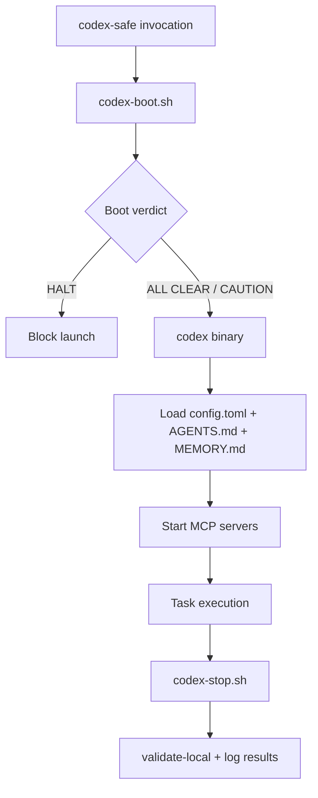

# ZakOps Agentic AI OS

## Codex CLI Infrastructure Reference

### Version 2 (Codex Consolidated + Live State Overlay)

| Field | Value |
|---|---|
| Document Class | Authoritative Infrastructure Reference |
| Build | Version 2 (Codex-tailored from V7PP reference model) |
| Date | February 12, 2026 |
| Base Reference | `/home/zaks/bookkeeping/docs/ZakOps-V7PP-Claude-Code-Infrastructure-Reference-Version-2.md` |
| Secondary Reference | `/home/zaks/bookkeeping/docs/ClaudeCode_Setup_ZakOps_V5PP_Guide.md` |
| Scope | Codex CLI runtime infrastructure, safety model, wrapper lifecycle, MCP stability, memory, contract surfaces |
| Platform | WSL + local Codex CLI (`codex-cli 0.99.0`) |

---

## 1. Executive Summary

This Version 2 document defines the operational Codex CLI infrastructure for ZakOps as of February 12, 2026.

It is the Codex-equivalent infrastructure reference to the Claude V7PP family, but adapted to Codex-native constraints and implemented compensating controls (wrapper lifecycle, startup diagnostics, MCP hardening, and strict session policies).

### 1.1 Consolidated Snapshot (Codex Runtime + Live Verification)

| Component | Target | Live State (2026-02-12) |
|---|---:|---:|
| Codex CLI Version | >= 0.98 | 0.99.0 |
| Global instruction file | 1 | 1 (`/home/zaks/.codex/AGENTS.md`) |
| Profiles | 5 | 5 (`labloop-qa`, `labloop-qa-debug`, `builder`, `review`, `forensic`) |
| MCP servers (configured) | 2+ | 2 (`github`, `playwright`) |
| MCP startup timeouts | explicit | yes (45s github, 30s playwright) |
| User skills | 19 | 19 |
| Project skills | 7 | 7 |
| Sandbox prefix rules | ~40 | 43 |
| Wrapper lifecycle scripts | 4 | 4 (`codex-boot/stop/notify/wrapper`) |
| Boot diagnostics checks | 6 (+ optional warning checks) | 6 active checks |
| Contract registry entries validated | 10 | 10 |
| Contract surfaces governed | 14 | 14 |

### 1.2 High-Impact Architectural Changes (Codex vs Claude)

The Codex stack achieves operational parity by replacing unavailable native hooks with wrapper-driven lifecycle enforcement:

1. `codex-safe` launcher executes pre-session diagnostics (`codex-boot.sh`).
2. Session executes with Codex config + AGENTS + memory context.
3. Post-session validation runs automatically (`codex-stop.sh`).
4. All events are logged with timestamps in `codex-events.log`.
5. `CODEX_FORCE=1` is gated by mandatory `CODEX_FORCE_REASON` audit metadata.

---

## 2. Configuration Architecture

### 2.1 Core Layering Model

| Layer | Path | Purpose |
|---|---|---|
| Codex runtime config | `/home/zaks/.codex/config.toml` | Model, sandbox, approvals, profiles, trust, MCP servers |
| Codex global instructions | `/home/zaks/.codex/AGENTS.md` | Operating policy, service map, guardrails, capability gaps |
| Session memory | `/home/zaks/.claude/projects/-home-zaks/memory/MEMORY.md` | Persistent workflow and alignment directives |
| Project instruction surface | `/home/zaks/zakops-agent-api/.agents/AGENTS.md` | Project-specific execution constraints |
| Project rules and commands | `/home/zaks/zakops-agent-api/.claude/rules/*.md`, `.claude/commands/*.md` | Contract/rule context and operational command patterns |

### 2.2 Runtime Flow

### 2.3 Codex Config Highlights

- Default model: `gpt-5.3-codex`
- Default sandbox: `read-only`
- Default approvals: `never`
- History persistence: `save-all`
- Trusted projects:
  - `/home/zaks/zakops-agent-api`
  - `/home/zaks/zakops-backend`
  - `/home/zaks/bookkeeping`
  - `/home/zaks`

---

## 3. Permissions and Enforcement Model

### 3.1 Designed Policy

- Read-only by default.
- `workspace-write` only through explicit profile or runtime context.
- Approvals default to `never` for deterministic automation.
- Codex sandbox prefix rules enumerate permitted command families.

### 3.2 Effective Safety Layer (What Actually Stops Unsafe Actions)

Codex enforcement is multi-layered:

1. Sandbox mode (`read-only` by default).
2. Rule allowlist in `/home/zaks/.codex/rules/default.rules`.
3. Wrapper boot verdict gate (block launch on critical failures).
4. `CODEX_FORCE` policy gate with required reason.
5. AGENTS behavioral constraints and path discipline.

### 3.3 Privilege Model (Persistent)

`zaks` has full sudo capability. Required policy:

- Use normal user context by default.
- Use `sudo -n` only when root access is required (e.g., root-owned lifecycle files).
- If root writes under `/home/zaks/`, normalize ownership back to `zaks:zaks`.

---

## 4. Lifecycle and Wrapper Subsystem

### 4.1 Wrapper Scripts

| Script | Path | Role |
|---|---|---|
| Boot diagnostics | `/home/zaks/scripts/codex-boot.sh` | Pre-session system checks and verdict generation |
| Stop validation | `/home/zaks/scripts/codex-stop.sh` | Post-session `make validate-local` and event logging |
| Notify handler | `/home/zaks/scripts/codex-notify.sh` | Captures Codex notify payloads |
| Unified launcher | `/home/zaks/scripts/codex-wrapper.sh` | Orchestrates boot -> run -> stop lifecycle |

### 4.2 Wrapper Contract

| Condition | Behavior |
|---|---|
| Boot FAIL | Session blocked (`HALT`) |
| Boot WARN | Session allowed (`PROCEED WITH CAUTION`) |
| Boot PASS | Session allowed (`ALL CLEAR`) |
| `CODEX_FORCE=1` without reason | Block with exit 2 |
| `CODEX_FORCE=1` with reason | Allow and log force override metadata |

### 4.3 Event Logging

- Event log: `/home/zaks/bookkeeping/logs/codex-events.log`
- Health log: `/home/zaks/bookkeeping/health-log.md`
- Events include: `BOOT`, `SESSION_START`, `STOP`, `SESSION_END`, `FORCE_OVERRIDE`.

---

## 5. Boot Diagnostics Subsystem

### 5.1 Active Checks

| Check | Name | Failure Class |
|---|---|---|
| 1 | Memory integrity (primary/fallback path) | WARN |
| 2 | Surface count consistency | FAIL |
| 3 | Sentinel freshness | WARN |
| 4 | Generated files present | FAIL |
| 5 | Codegen freshness | WARN |
| 6 | Constraint registry verification | FAIL |

### 5.2 Verdict States

| Verdict | Condition | Result |
|---|---|---|
| `ALL CLEAR` | 0 warnings, 0 failures | Proceed |
| `PROCEED WITH CAUTION` | warnings only | Proceed with caution |
| `HALT -- FIX FIRST` | >=1 failure | Block until fixed |

### 5.3 Boot Data Paths

| Path | Purpose |
|---|---|
| `/home/zaks/.claude/projects/-home-zaks/memory/MEMORY.md` | Canonical memory source |
| `/root/.claude/projects/-home-zaks/memory/MEMORY.md` | Fallback memory source |
| `/home/zaks/bookkeeping/logs/codex-events.log` | Event stream |
| `/home/zaks/bookkeeping/health-log.md` | Health trend ledger |

---

## 6. Constraint Registry and Rules Model

### 6.1 Constraint Registry

- Registry file: `/home/zaks/zakops-agent-api/.claude/CONSTRAINT_REGISTRY.md`
- Live entries: 10
- Verified by boot CHECK 6.

### 6.2 Codex Rule Surface

- Rule file: `/home/zaks/.codex/rules/default.rules`
- Prefix rules: 43
- Categories:
  - Health checks
  - Docker operations
  - Make targets
  - Test commands
  - Git read operations
  - File inspection utilities
  - System utilities + approved sudo append/read prefixes

### 6.3 Project Rule Surface

- Path-scoped rules: 7
- Location: `/home/zaks/zakops-agent-api/.claude/rules/*.md`
- Coverage includes backend API, agent tools, contract surfaces, design system, dashboard types, and accessibility/component patterns.

---

## 7. Commands, Skills, and Contract Surfaces

### 7.1 Command and Skill Inventory

| Artifact Type | Count | Location |
|---|---:|---|
| Project command docs | 16 | `/home/zaks/zakops-agent-api/.claude/commands/*.md` |
| User Codex skills | 19 | `/home/zaks/.codex/skills/*/SKILL.md` |
| Project skills | 7 | `/home/zaks/zakops-agent-api/.agents/skills/*/SKILL.md` |

### 7.2 Contract Surfaces

Codex instructions enforce the same 14 contract surfaces used by ZakOps governance, with sync/validate commands delegated to the monorepo Makefile.

### 7.3 Generated-File Protection

Never edit generated files directly:

- `apps/dashboard/src/lib/api-types.generated.ts`
- `apps/dashboard/src/lib/agent-api-types.generated.ts`
- `apps/agent-api/app/schemas/backend_models.py`
- `zakops-backend/src/schemas/rag_models.py`

---

## 8. Memory, Logging, and Session Discipline

### 8.1 Memory Contract

Startup path policy:

1. Primary: `/home/zaks/.claude/projects/-home-zaks/memory/MEMORY.md`
2. Fallback: `/root/.claude/projects/-home-zaks/memory/MEMORY.md`

Memory includes persistent mission workflow and Codex alignment notes.

### 8.2 Logging Paths

| Log | Path |
|---|---|
| Codex events | `/home/zaks/bookkeeping/logs/codex-events.log` |
| Health trend | `/home/zaks/bookkeeping/health-log.md` |
| Change ledger | `/home/zaks/bookkeeping/CHANGES.md` |

### 8.3 Session Discipline

- At start: load memory.
- During run: evidence for every claim.
- At end: update `CHANGES.md` and preserve validation traces.

---

## 9. MCP Architecture and Reliability

### 9.1 Configured MCP Servers

| Server | Command | Args | Startup Timeout | Tool Timeout |
|---|---|---|---:|---:|
| github | `/home/zaks/.npm-global/bin/mcp-server-github` | `[]` | 45s | 120s |
| playwright | `/home/zaks/.npm-global/bin/playwright-mcp` | `--headless --no-sandbox --isolated` | 30s | 120s |

### 9.2 Why This Configuration

- `github`: local binary avoids npx startup variance and transient network delays.
- `playwright`: `--isolated` avoids persistent browser-profile lock contention across sessions.

### 9.3 Status Classification Contract

MCP verification uses two independent statuses:

1. `configured_status` (registry and transport correctness)
2. `connectivity_status` (real tool call success)

Both must pass for operational readiness.

---

## 10. Service and Environment Reference

### 10.1 Service Map

| Service | Port | Runtime |
|---|---:|---|
| Dashboard | 3003 | Bare process |
| Backend API | 8091 | Docker |
| Agent API | 8095 | Docker |
| RAG REST | 8052 | Docker |
| vLLM | 8000 | Docker |
| OpenWebUI | 3000 | Docker |
| PostgreSQL | 5432 | Docker |

### 10.2 WSL Hazards

1. CRLF shell breakage (`bash\r: not found`).
2. Root ownership drift after elevated operations.
3. Dual tool-path confusion.
4. `grep -c` non-zero exit on zero matches.

---

## 11. Key Paths (Codex Reference)

| Domain | Path |
|---|---|
| Codex config | `/home/zaks/.codex/config.toml` |
| Codex instructions | `/home/zaks/.codex/AGENTS.md` |
| Codex rules | `/home/zaks/.codex/rules/default.rules` |
| Codex skills | `/home/zaks/.codex/skills/` |
| Session memory | `/home/zaks/.claude/projects/-home-zaks/memory/MEMORY.md` |
| Wrapper scripts | `/home/zaks/scripts/codex-*.sh` |
| Project AGENTS | `/home/zaks/zakops-agent-api/.agents/AGENTS.md` |
| Project rules | `/home/zaks/zakops-agent-api/.claude/rules/` |
| Project commands | `/home/zaks/zakops-agent-api/.claude/commands/` |
| QA mission prompt | `/home/zaks/bookkeeping/docs/QA-CODEX-ALIGN-VERIFY-001.md` |
| Alignment mission | `/home/zaks/bookkeeping/missions/CODEX-ALIGN-001-CODEX-CLI-ALIGNMENT.md` |
| Alignment reports | `/home/zaks/bookkeeping/missions/codex-align-001-artifacts/reports/` |

---

## 12. Capability Gap Register (Codex vs Claude)

These are structural platform gaps and must remain explicit:

1. No native pre-tool hooks equivalent to Claude `PreToolUse` gate enforcement.
2. No native persistent memory mechanism; memory is file-based/manual contract.
3. No sub-agent delegation mechanism.
4. No compaction hook family.
5. No post-edit hook family equivalent.
6. No task-completed hook equivalent.

Mitigation strategy: wrapper lifecycle + AGENTS policy + strict validation workflow.

---

## 13. Operational Verification Checklist

A session is considered healthy when all pass:

1. `codex mcp get github --json` reflects local binary + timeout policy.
2. `codex mcp get playwright --json` includes `--isolated` + timeout policy.
3. Playwright MCP returns `Example Domain` for `https://example.com`.
4. GitHub MCP returns `https://github.com/openai/codex` for repository search smoke test.
5. `codex-safe --version` yields non-HALT boot verdict.
6. `make validate-local` remains green after lifecycle run.

---

## 14. Document Governance

### 14.1 Update Triggers

Update this document when any of the following changes:

- `/home/zaks/.codex/config.toml`
- `/home/zaks/.codex/AGENTS.md`
- `/home/zaks/.codex/rules/default.rules`
- `/home/zaks/scripts/codex-*.sh`
- MCP transport command/args/timeouts
- Skill inventory or project-surface governance model

### 14.2 Source of Truth Policy

When this reference conflicts with live runtime files, runtime files win and this document must be updated immediately.

### 14.3 Traceability

All updates must be logged in `/home/zaks/bookkeeping/CHANGES.md` with:

- change reason,
- files touched,
- verification evidence,
- residual risks.

---

## Appendix A — Claude-to-Codex Section Mapping

| Claude V7PP Reference Area | Codex Equivalent |
|---|---|
| Root/user/project settings layering | Codex config + AGENTS + project rule/command surfaces |
| Hook enforcement | Wrapper lifecycle emulation (`codex-boot/stop/wrapper`) |
| Boot diagnostics and verdict model | Ported into `codex-boot.sh` checks and verdict states |
| Slash commands | Project command docs + Codex skills |
| Memory sync model | File-based startup memory contract |
| MCP server layer | Codex `[mcp_servers.*]` config with explicit timeouts |

## Appendix B — Known Non-Blocking Runtime Noise

The following are currently non-blocking and do not indicate MCP failure by themselves:

- `codex_core::rollout::list: state db missing rollout path for thread ...`
- `bash: cannot set terminal process group ...` (non-interactive shell context)
- `bash: no job control in this shell` (non-interactive shell context)

These messages should be monitored for drift but are not pass/fail criteria for MCP connectivity.

---

*End of Document - ZakOps-V7PP-Codex-CLI-Infrastructure-Reference-Version-2.md*
